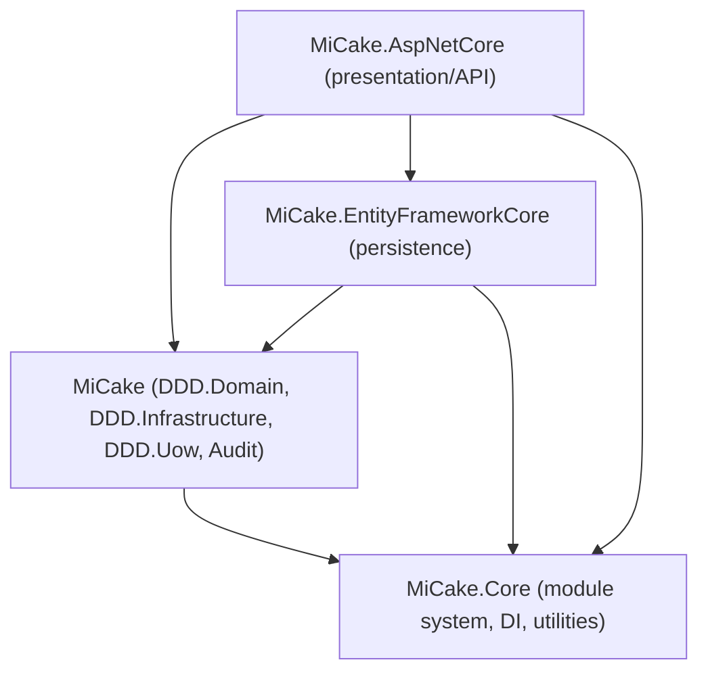

# Project: default

## Overview

MiCake is a lightweight Domain-Driven Design (DDD) toolkit for .NET (targets `net10.0`). It is not a full application framework but a non-invasive set of composable packages that let existing projects adopt DDD tactical patterns incrementally. The solution is organized as four packages layered bottom-up: `MiCake.Core` (module system, DI conventions, generic utilities), `MiCake` (DDD tactical building blocks: Entity/AggregateRoot/ValueObject, domain events, Repository/UnitOfWork abstractions, Audit/SoftDeletion), `MiCake.EntityFrameworkCore` (EF Core persistence implementation of the DDD ports), and `MiCake.AspNetCore` (ASP.NET Core presentation-layer integration: response wrapping, per-request UnitOfWork, API logging). Dependency direction is strictly one-way: Core → MiCake (DDD) → EntityFrameworkCore → AspNetCore; lower layers never reference higher ones.

## Core Terms

| Term | Meaning |
|---|---|
| IMiCakeApplication / MiCakeApplication | Runtime app instance; `Start()`/`ShutDown()`, exposes `ApplicationOptions` and module context |
| IMiCakeBuilder / MiCakeBuilder | Pre-DI-build configuration surface wrapping `IServiceCollection`; validates entry module, runs module `ConfigureServices` phase; `Build()` is one-shot |
| IMiCakeModule / MiCakeModule | Standard module contract: `ConfigureServices`, `OnApplicationInitialization`, `OnApplicationShutdown`, `IsFrameworkLevel`, `EnableAutoServiceRegistration` |
| IMiCakeModuleAdvanced | Adds Pre/Post hooks around each of the 3 standard module lifecycle phases |
| RelyOnAttribute | Declares a module's dependency types, used for topological load ordering |
| MiCakeRootModule / MiCakeEssentialModule | Framework-level root modules that all app modules implicitly depend on |
| ModuleDependencyResolver | Topological sorter (Kahn's algorithm) with load priority: root module → framework modules → regular modules; detects circular dependencies |
| ITransientService / IScopedService / ISingletonService / IAutoInjectService | Marker interfaces triggering automatic DI registration with the matching lifetime |
| InjectServiceAttribute | Explicit DI registration control (service types, lifetime, self-inclusion, replace-existing) |
| IBusinessException / BusinessException | End-user-safe exception carrying Code/Message/Details, distinct from internal exceptions |
| IEntity / Entity | Base entity contract/class; identity-based equality (never equal if both Ids are default) |
| IAggregateRoot / AggregateRoot | Marker for the consistency-boundary root entity; only type usable with `IRepository<T,TKey>` |
| IValueObject / ValueObject / RecordValueObject | Value object base; structural equality via `GetEqualityComponents()` |
| IDomainEvent / DomainEvent | Marker for events raised by entities |
| IEventDispatcher / EventDispatcher | Dispatches a domain event to registered `IDomainEventHandler<T>` via DI |
| DomainEventOptions | Failure strategy for event dispatch: ContinueOnError / StopOnError / ThrowOnError (default ThrowOnError) |
| IRepository / IReadOnlyRepository | Write / read-only persistence port for aggregate roots (persistence-agnostic) |
| IUnitOfWork / IUnitOfWorkManager | Transactional boundary abstraction; supports nested UoW via AsyncLocal ambient context, savepoints, commit/rollback lifecycle events |
| PersistenceStrategy | `TransactionManaged` (explicit transaction) vs `OptimizeForSingleWrite` (relies on SaveChanges implicit transaction) |
| IAuditProvider / DefaultTimeAuditProvider | Applies audit logic (e.g. CreatedAt/UpdatedAt) given entity + `RepositoryEntityStates` |
| ISoftDeletable / SoftDeletionAuditProvider | Soft-delete marker and provider; sets `IsDeleted`/`DeletedAt` instead of physical delete |
| IRepositoryPreSaveChanges / IRepositoryPostSaveChanges | Ordered hooks (`Order` ascending) run around repository save, used by domain-event dispatch, audit, and soft-deletion |
| IStoreConvention (IEntityConvention / IPropertyConvention) | Pluggable convention pipeline letting the persistence layer configure entity/property behavior (e.g. soft-delete query filter) without the domain layer depending on EF Core |
| MiCakeDbContext | Base DbContext auto-applying MiCake conventions and SaveChanges interceptors |
| EFRepository / EFReadOnlyRepository / EFRepositoryHasPaging | EF Core implementations of the repository ports, including dynamic filter/paging queries |
| MiCakeEFCoreInterceptor / LazyEFSaveChangesLifetime | `ISaveChangesInterceptor` that captures changed entries and invokes Pre/PostSaveChanges hooks around EF `SaveChanges` |
| EFCoreDbContextWrapper | Implements the UoW resource contract with two-phase Prepare/Activate transaction lifecycle and savepoints |
| ApiResponse / ErrorResponse / IResponseWrapper | Unified success/error HTTP response envelope; types implementing `IResponseWrapper` bypass wrapping |
| UnitOfWorkAttribute / UnitOfWorkFilter | Declarative per-action/controller UnitOfWork configuration and the MVC filter that creates/commits/rolls back it |
| ApiLoggingFilter / IApiLogProcessor | MVC filter orchestrating API request/response logging, sensitive-data masking, and truncation |
| Filter / FilterGroup (dynamic query) | Dynamic query building blocks with AND/OR joins and nested property support |
| PagingRequest / PagingResponse | Paging primitives (PageIndex/PageSize; TotalCount/Data) |
| CircuitBreakerConfig / ICircuitBreakerProvider | Resilience abstraction with failure/success thresholds and provider-selection strategy |

## Module Structure

| Module | Path | Responsibility | Depends on |
|---|---|---|---|
| MiCake.Core | `src/framework/MiCake.Core` | Module bootstrap system (discovery, dependency resolution, lifecycle boot/shutdown), DI auto-registration conventions, business-exception base, framework-agnostic utilities (dynamic filter, paging, circuit breaker) | Microsoft.Extensions.DependencyInjection/Logging/Options only — no other MiCake package |
| MiCake | `src/framework/MiCake` | DDD tactical patterns: Entity/AggregateRoot/ValueObject, domain events + dispatch, Repository/UnitOfWork abstractions (persistence-agnostic), domain metadata reflection, Audit/SoftDeletion cross-cutting behavior | MiCake.Core |
| MiCake.EntityFrameworkCore | `src/framework/MiCake.EntityFrameworkCore` | EF Core implementation of the DDD ports: `MiCakeDbContext`, `EFRepository`/`EFReadOnlyRepository`, EF-backed UnitOfWork/transaction management, SaveChanges interceptors wiring domain-event/audit hooks | MiCake, MiCake.Core, EF Core |
| MiCake.AspNetCore | `src/framework/MiCake.AspNetCore` | ASP.NET Core presentation-layer integration: unified response wrapping, per-request UnitOfWork via attribute/filter, API request logging with sensitive-data masking | MiCake, MiCake.EntityFrameworkCore, ASP.NET Core |

Domain entity classification: `Entity`/`AggregateRoot` = domain model; `ValueObject`/`RecordValueObject` = value object; `ApiResponse`/`ErrorResponse`/`PagingRequest`/`PagingResponse` = DTO; `MiCakeApplicationOptions`/`MiCakeAspNetOptions`/`MiCakeEFCoreOptions`/`MiCakeAuditOptions`/`UnitOfWorkOptions`/`ResponseWrapperOptions`/`ApiLoggingOptions`/`CircuitBreakerConfig` = configuration.

## Layer Structure

Dependency direction is strictly one-way and must not be reversed:

Within the `MiCake` package, `DDD/Domain` (pure abstractions: `IEntity`, `Entity`, `AggregateRoot`, `ValueObject`, `IDomainEvent`, `IRepository`) never references `DDD/Infrastructure` (framework plumbing: lifetime hooks, metadata scanning, store conventions) — Infrastructure depends on Domain, never the reverse. `DDD.Domain.Internal` types (e.g. `IDomainEventAccessor`) are `internal`, hidden from public API, accessible only to same-assembly infrastructure code.

Forbidden imports: the Domain layer (`MiCake` DDD.Domain) must not depend on `MiCake.EntityFrameworkCore` or `MiCake.AspNetCore`; `MiCake.AspNetCore` is the outermost layer and must only be referenced by the host Web/API project, never by domain/application code.

## Key Business Rules

- Entity equality is identity-based: two entities with default (unset) Id are never equal, even if otherwise identical; ValueObject equality is structural via `GetEqualityComponents()` and requires an exact type match.
- Domain events raised on an entity are dispatched in the pre-save phase (`Order=-1000`, runs early) — before the actual persistence commit — and cleared in the post-save phase (`Order=1000`, runs last) after save succeeds, preventing re-dispatch. Dispatch failure handling is governed by `DomainEventOptions` (default: throw on error, aborting the operation).
- Soft-deletion converts a `Deleted` entity state to `Modified` and sets `IsDeleted=true`/`DeletedAt` instead of performing a physical delete; the EF-side query filter `entity => !entity.IsDeleted` is applied automatically via `SoftDeletionConvention`.
- Repository lifetime hooks (`IRepositoryPreSaveChanges`/`IRepositoryPostSaveChanges`) execute in ascending `Order`; domain-event dispatch and audit hooks run first (`-1000`), soft-deletion runs last among pre-save hooks (`1000`) so it can safely override any state set earlier.
- UnitOfWork supports nesting via an AsyncLocal ambient context: a nested UoW's commit only marks itself completed (actual commit deferred to the root), while a nested rollback flags the root to roll back on its own commit attempt. Disposal without explicit Commit/Rollback logs a warning and marks the UoW completed (no implicit rollback).
- Module load order priority: the root module loads first, then other framework-level modules, then regular modules (subject to `RelyOnAttribute` dependency constraints); the application's entry module is always forced to load last. Circular module dependencies throw an error listing the affected modules.
- Auto DI registration applies only to types implementing `IAutoInjectService` (when the owning module has `EnableAutoServiceRegistration=true`) or types carrying `InjectServiceAttribute`.
- ASP.NET Core response wrapping is skipped when `[SkipResponseWrapper]` is present, the response status code is in the ignore list (default: 201, 202, 404), or the response data already implements `IResponseWrapper`. Business exceptions (`IBusinessException`) return HTTP 200 with an `ApiResponse` carrying the exception's own error code (falling back to a default error code if empty); unhandled exceptions return HTTP 500.
- Per-request UnitOfWork is enabled by default; actions named with a Find/Get/Query/Search prefix (configurable) are treated as read-only and marked completed without committing. Attribute precedence: action > controller > endpoint metadata.
- API request logging masks sensitive fields (default: `authorization`) in request/response bodies and query strings before truncating oversized bodies (default limit: 4096 bytes per side); logging is skipped for excluded paths (default `/health`, `/metrics`) or when `[SkipApiLogging]` is present, and forced via `[AlwaysLog]` regardless of status-code exclusion rules.

## API Overview

**Bootstrap / DI (MiCake.Core, MiCake, MiCake.EntityFrameworkCore, MiCake.AspNetCore)**
- `IServiceCollection.AddMiCake<TEntryModule>(...)` — register the MiCake module system against an entry module.
- `IServiceCollection.AddMiCakeWithDefault<TEntryModule, TDbContext>(...)` — convenience chain: `AddMiCake` → `UseAudit` → `UseEFCore` → `UseAspNetCore`.
- `IMiCakeBuilder.UseAudit(...)`, `.UseEFCore<TDbContext>(...)`, `.UseAspNetCore(...)`, `.Build()`.
- `IApplicationBuilder.StartMiCake()` / `.ShutdownMiCake()`.

**Domain / Repository (MiCake, MiCake.EntityFrameworkCore)**
- `IRepository<TAggregateRoot, TKey>`: `AddAsync`, `AddAndReturnAsync`, `UpdateAsync`, `DeleteAsync`, `DeleteByIdAsync`, `SaveChangesAsync`, `ClearChangeTrackingAsync`.
- `IReadOnlyRepository<TAggregateRoot, TKey>`: `Query()`, `FindAsync(id[, includeFunc])`, `GetCountAsync()`.
- `EFRepositoryHasPaging`: `PagingQueryAsync`, `FilterPagingQueryAsync`, `FilterQueryAsync` (dynamic filter + sort).
- `IUnitOfWorkManager.BeginAsync(...)`; `IUnitOfWork.CommitAsync`/`RollbackAsync`/`MarkAsCompletedAsync`/savepoint API.
- `ModuleConfigServiceContext.RegisterRepository<TService, TImpl>`; `AutoRegisterRepositoriesExtension.AutoRegisterRepositories(assembly)`; `RegisterDomainServiceExtension.RegisterDomainService<TService, TImpl>`.

**ASP.NET Core attributes and filters (MiCake.AspNetCore)**
- `[UnitOfWork]` / `[DisableUnitOfWork]` — per-action/controller transaction control.
- `[SkipResponseWrapper]` — bypass unified response wrapping.
- `[AlwaysLog]` / `[SkipApiLogging]` / `[LogFullResponse(MaxSize=...)]` — API logging control.
- Auto-registered MVC filters: `UnitOfWorkFilter`, `ResponseWrapperFilter` + `ExceptionResponseWrapperFilter`, `ApiLoggingFilter`.
- Extensible via DI: `IApiLoggingConfigProvider`, `IApiLogWriter`, `ISensitiveDataMasker`, `IApiLogEntryFactory`, `IApiLogProcessor`, `ResponseWrapperOptions.WrapperFactory`.
