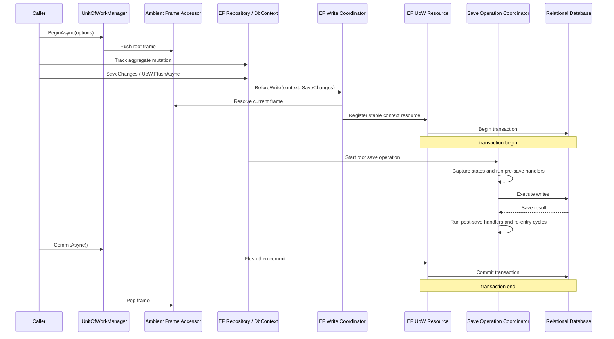
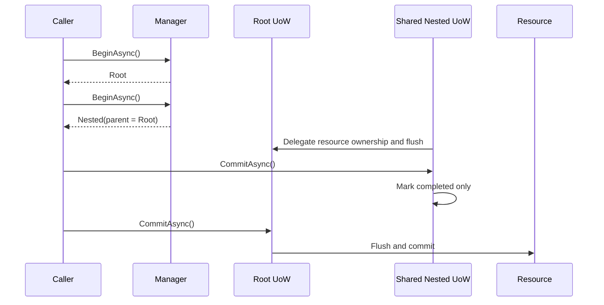
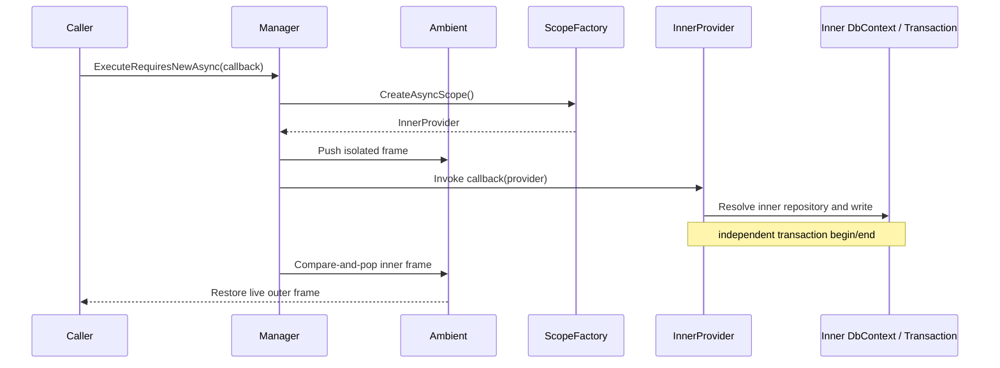
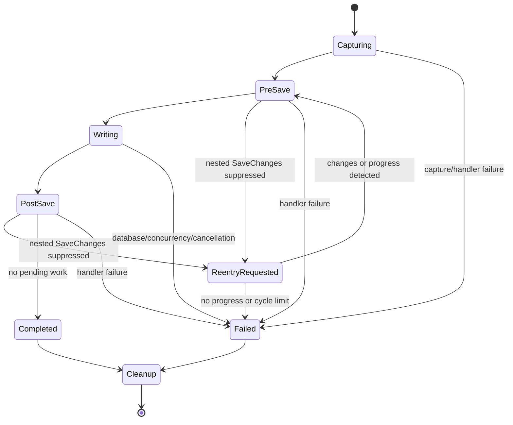

# Architecture Design: UoW Transaction Reliability

## Overview

This design makes the Unit of Work the sole persistence boundary for MiCake-mediated writes. Every writable UoW uses an explicit transaction; read-only UoWs are the only non-transactional mode. The design introduces host-local ambient execution frames, write-before-command transaction activation and command binding, isolated `requiresNew` and standalone execution scopes, per-DbContext save-operation state, and explicit best-effort multi-resource outcomes. It preserves the existing inward dependency direction (`MiCake.Core` -> `MiCake` -> `MiCake.EntityFrameworkCore` -> `MiCake.AspNetCore`) while accepting targeted breaking changes to repository, UoW, and ASP.NET Core contracts.

### Architectural Concerns

| Concern | Source of evidence | Priority |
|---|---|---|
| One persistence owner and transaction activation before every supported write | R1-R8 | must |
| Full DI scope, DbContext, ChangeTracker, transaction, and ambient isolation for `requiresNew` | R9-R14 | must |
| Save lifecycle isolation, deterministic cleanup, state preservation, and controlled re-entry | R15-R22, R45 | must |
| Enforced read-only behavior, stable context identity, and explicit standalone persistence | R23-R28 | must |
| Explicit repository, resource identity, detached update, and multi-resource contracts | R29-R37 | should |
| Relational verification, diagnostics, migration guidance, and performance baselines | R38-R50 | should |

### Concern-to-Module Mapping

| Concern | Architectural response | Owning module | Boundary impact |
|---|---|---|---|
| Persistence ownership | Remove repository-owned save; expose UoW-controlled flush | MiCake | Breaking public contract |
| Write-before-transaction activation | Activate before SaveChanges; activate and bind the current non-query command before execution | MiCake.EntityFrameworkCore | New internal provider boundary |
| `requiresNew` isolation | Host-local ambient stack plus delegate-based isolated scope execution | MiCake / MiCake.EntityFrameworkCore | Breaking public contract and new DI scope |
| Lifecycle safety | Per-DbContext root save-operation coordinator | MiCake.EntityFrameworkCore | Replaces singleton mutable state |
| Read-only and standalone behavior | Enforced write guard and explicit standalone executor | MiCake / MiCake.EntityFrameworkCore | New public contract |
| HTTP automatic UoW | Explicit read-only metadata and transactional default | MiCake.AspNetCore | Behavior and attribute change |
| Multi-resource consistency | Structured best-effort commit outcome and exception | MiCake | Public diagnostic contract |
| Verification | SQLite relational acceptance matrix and benchmark baseline | Test projects | Test infrastructure extension only |

## Architecture Decision Records

### ADR-001: Make the UoW the sole persistence owner

- **Status:** accepted
- **Context:** Repository `SaveChangesAsync` and `AddAndReturnAsync(saveNow: true)` create competing persistence boundaries and can make data durable before the UoW controls a transaction.
- **Decision:** Repository mutation methods only modify the current UoW's tracked state. Remove repository `SaveChangesAsync`, `ClearChangeTrackingAsync`, and the `saveNow` parameter. Identity-generating writes use `IUnitOfWork.FlushAsync`, which activates required transactions but does not commit them. By default repository writes require an ambient writable UoW; when the host enables `AllowDbContextAccessWithoutUoW`, context resolution is relaxed and repository mutations follow the Permissive write policy (native EF semantics, no MiCake transaction or lifecycle guarantee).
- **Alternatives:** Keeping immediate repository save was rejected because it preserves competing owners. Silently translating immediate save into commit was rejected because it destroys rollback semantics.
- **Consequences:** Application code and samples must migrate. Generated identifiers use `AddAsync` followed by `IUnitOfWork.FlushAsync`; the aggregate instance receives its generated key after the flush. All persistence exits become enforceable and observable at one boundary.

### ADR-002: Activate transactions through save and command interception

- **Status:** accepted
- **Context:** SaveChanges interception alone does not cover `ExecuteUpdate`, `ExecuteDelete`, or EF raw SQL. API wrappers alone cannot protect direct DbContext use.
- **Decision:** Add a host-local, stateless SaveChanges interceptor and `DbCommandInterceptor`. The guard policy is **Permissive**: `SavingChanges[Async]` and `NonQueryExecuting[Async]` pass through without guarding when no ambient UoW is active, so vanilla EF usage keeps native semantics (MiCake never interferes). Inside an ambient UoW they resolve the frame, reject read-only UoWs, register the DbContext resource, and activate its transaction before EF creates write commands. For `ExecuteUpdate`, `ExecuteDelete`, `ExecuteSqlRaw`, and other supported non-query commands, `NonQueryExecuting[Async]` performs the same guard and activation, then explicitly assigns the resource's current provider transaction to `DbCommand.Transaction` before returning control to EF. It verifies that the command connection matches the transaction connection and fails before execution when the provider cannot bind the current command. Synchronous EF write paths use synchronous transaction activation and binding; providers without safe synchronous activation reject synchronous writes with a diagnostic. Direct ADO.NET use obtained from `DbConnection` is outside the framework-mediated contract and is documented as unsupported.
- **Alternatives:** SaveChanges-only interception was rejected due to bulk/raw SQL gaps. Framework wrapper APIs alone were rejected because direct injected DbContext writes are a required path.
- **Consequences:** Every supported EF write pays one ambient lookup and write guard. Command interception classifies supported writes from EF `CommandSource`, treats unknown non-query commands conservatively as writes, and emits diagnostics for unsupported command/transaction combinations. Relational acceptance tests must prove that the first bulk/raw SQL command is bound to the activated transaction and rolls back.

### ADR-003: Use delegate-based isolated scopes for `requiresNew`

- **Status:** accepted
- **Context:** Creating only a new UoW object cannot isolate repositories or DbContexts already resolved from the outer DI scope. Exposing a child UoW without a child service provider invites accidental outer-context use.
- **Decision:** Remove `requiresNew` from `BeginAsync`. Add `ExecuteRequiresNewAsync` methods that create an independent DI scope and pass that scope's `IServiceProvider` into a callback. The callback must resolve repositories and DbContexts from that provider. A host-local singleton ambient accessor maintains immutable AsyncLocal frames and restores the previous frame with token-based compare-and-pop on every exit.
- **Alternatives:** Reusing the caller's scoped services was rejected because it cannot satisfy ChangeTracker isolation. Exposing `IServiceProvider` as an `IUnitOfWork` property was rejected because it weakens ownership and permits use after disposal.
- **Consequences:** Existing `BeginAsync(requiresNew: true)` callers must migrate to callback execution. Inner commit cannot flush outer pending changes, and outer services cannot accidentally participate unless deliberately captured by application code; captured outer persistence services are detected by context/frame ownership validation.

### ADR-004: Store lifecycle state per DbContext and root save operation

- **Status:** accepted
- **Context:** Singleton mutable scope and entry collections race across contexts, leak on exceptional exits, and lose pre-save states after EF changes entry state.
- **Decision:** Register a per-DbContext save-operation state accessor through the EF Core options extension. It owns one root operation frame containing an immutable pre-save snapshot, the owning UoW frame token, dispatched event identities, re-entry state, and cleanup token. Lifecycle handlers are always resolved from the current UoW frame's `IServiceProvider`; they are never resolved from EF's internal/root provider or an unrelated temporary scope. The accessor implements EF Core's pool reset contract so a pooled context clears the UoW frame token, snapshots, handler references, dispatched identities, and re-entry state before returning to the pool. All success, failure, cancellation, concurrency, pool reset, and disposal paths converge on one asynchronous cleanup routine.
- **Alternatives:** A singleton dictionary keyed by ContextId was rejected because operation state remains globally mutable and cleanup-dependent. Creating unrelated DI scopes in each interceptor callback was rejected because pre/post handlers would not share operation state.
- **Consequences:** EF options integration becomes more explicit. State capture adds bounded allocation proportional to changed entries, measured by the performance baseline.

### ADR-005: Implement SaveChanges re-entry as a bounded state machine

- **Status:** accepted
- **Context:** Lifecycle or domain-event handlers may request SaveChanges. Recursive execution can duplicate event dispatch, corrupt cleanup, or recurse indefinitely.
- **Decision:** Nested SaveChanges detected inside an active root save operation is suppressed and recorded as a re-entry request. The root coordinator rescans changes and executes another save cycle in the same transaction. Domain-event identities already handled in the root operation are not redispatched. The loop terminates when no pending changes or re-entry request remains, when no progress is possible, or when `MaxSaveCycles` is reached; the latter two conditions throw `SaveChangesReentryException` and roll back the UoW.
- **Alternatives:** Prohibiting re-entry was rejected by R45. Unbounded recursive SaveChanges was rejected because it cannot provide deterministic cleanup or termination.
- **Consequences:** Handler behavior is predictable but no longer mirrors raw EF recursion. A conservative default of 16 cycles is configurable per host and covered by diagnostics and tests.

### ADR-006: Enforce read-only and make independent persistence explicit

- **Status:** accepted
- **Context:** Action-name inference is not a security or consistency boundary, and ordinary writes without an ambient UoW currently create unstable context and commit behavior.
- **Decision:** `UnitOfWorkOptions.IsReadOnly` is authoritative: every framework-mediated write guard rejects read-only writes. Writes without an ambient UoW pass through unguarded with native EF semantics (Permissive policy); the guard applies only when a UoW is active. Add provider-neutral `IStandaloneUnitOfWorkExecutor` and its runtime implementation in MiCake. It requires no ambient UoW, creates an isolated DI scope, establishes a root writable UoW, executes a callback using that provider, commits on success, rolls back on failure, and always disposes asynchronously. Persistence providers participate through `IUnitOfWorkResource`; the standalone executor contains no EF Core dependency. ASP.NET action-name inference remains an opt-in compatibility setting.
- **Alternatives:** Keeping a global bypass flag was rejected because it makes ownership host-global and implicit. Repository auto-commit was rejected because it recreates a second persistence boundary.
- **Consequences:** Background jobs and migration-style application operations must use the explicit standalone executor. Read-only failures become immediate and diagnosable.

### ADR-007: Keep multi-resource commit explicitly best-effort

- **Status:** accepted
- **Context:** The framework coordinates resources sequentially and does not provide a distributed transaction.
- **Decision:** Commit resources in deterministic registration order and track each resource as pending, committed, failed, or rolled back. On failure, attempt rollback only for eligible uncommitted resources and throw `PartialUnitOfWorkCommitException` containing a non-sensitive structured outcome. Never report the overall UoW as rolled back after any resource committed.
- **Alternatives:** Distributed transactions were rejected as outside scope and inconsistent with lightweight deployment goals. Pretending rollback restores all resources was rejected as false.
- **Consequences:** Applications requiring cross-resource atomicity must select an explicit strategy such as an outbox or compensation workflow. Logs and exceptions expose uncertain and partial outcomes.

### ADR-008: Keep domain events transactional and integration delivery application-owned

- **Status:** accepted
- **Context:** Domain handlers may enforce invariants inside persistence, while integration events cannot be reliably published before durable commit without an outbox.
- **Decision:** MiCake domain events remain inside the active transaction and participate in the controlled save-operation loop. This change does not add an implicit integration-event publisher or queue dependency. Integration events are published only after durable commit by an application-selected mechanism; reliable delivery should use an application outbox stored in the same transaction.
- **Alternatives:** Publishing integration events from pre-save handlers was rejected because rollback would expose nonexistent state. Adding a mandatory message broker/outbox framework was rejected as scope expansion and contrary to non-invasive adoption.
- **Consequences:** Documentation must clearly separate domain and integration events. Applications own integration transport, retries, and idempotency.

### ADR-009: Remove ineffective timeout and validate supported context lifetimes

- **Status:** accepted
- **Context:** `UnitOfWorkOptions.Timeout` has no runtime effect, while unsupported DbContext lifetime combinations produce divergent identity and tracking.
- **Decision:** Remove `Timeout`. At host startup, validate each registered MiCake DbContext and require scoped or supported pooled registration through the MiCake integration. Immediate transaction initialization uses typed registration descriptors rather than reflective service probing.
- **Alternatives:** Implementing provider-specific timeout translation was rejected because command, lock, and transaction timeouts are distinct concepts. Runtime best-effort context discovery was rejected due to weak diagnostics and incomplete coverage.
- **Consequences:** Migration documentation directs users to EF/provider command timeout configuration. Invalid registrations fail during startup with context type and expected registration guidance.

### ADR-010: Verify relational guarantees with SQLite and a repeatable baseline

- **Status:** accepted
- **Context:** EF InMemory cannot verify transactions or savepoints, while the repository already references EF Core SQLite.
- **Decision:** Use temporary file-backed SQLite databases for transaction, savepoint, bulk/raw SQL, and `requiresNew` acceptance tests. Use separate connections for isolated scopes. Add a repeatable benchmark harness for common reads, tracked writes, flushes, lifecycle handling, and transaction activation; compare allocation and elapsed distributions against a recorded baseline under the same runtime configuration.
- **Alternatives:** SQLite in-memory with one shared connection was rejected because it conflicts with independent `requiresNew` connections. Adding Testcontainers as a mandatory dependency was rejected for this change; provider-specific concurrency suites may be added later.
- **Consequences:** Tests remain locally executable without an external server. SQLite lock behavior is not treated as proof of production-provider write concurrency semantics.

### ADR-011: Require explicit transactions for every writable UoW

- **Status:** accepted
- **Context:** `OptimizeForSingleWrite` allows EF's implicit SaveChanges transaction to commit before post-save lifecycle processing completes. A post-save or controlled re-entry failure can therefore return an error after data is durable, contradicting the UoW rollback and transactional domain-event contracts.
- **Decision:** Remove `PersistenceStrategy` and `OptimizeForSingleWrite`. Every writable root, standalone, and `requiresNew` UoW uses explicit transactions. `TransactionInitializationMode.Lazy` activates each resource before its first supported write; `Immediate` eagerly resolves and activates every registered DbContext resource when the UoW begins. Read-only UoWs do not activate transactions and reject writes. There is no framework-managed non-transactional write mode.
- **Alternatives:** Retaining and renaming the mode to `NonTransactional` was rejected because it requires a second failure/outcome model and cannot support transactional post-save handlers or controlled re-entry. Keeping the old name with documentation only was rejected because the API would continue to imply rollback semantics it cannot provide.
- **Consequences:** A single-write operation pays explicit transaction overhead. The public strategy enum and properties are removed, and migration guidance maps `OptimizeForSingleWrite` callers to the default writable UoW. MiCake does not transparently retry an entire arbitrary UoW callback; EF execution strategies with `RetriesOnFailure=true` are rejected for ordinary ambient writable UoWs with guidance to use an application-owned replayable boundary. Applications that deliberately require non-transactional commands must leave the MiCake UoW contract and use provider APIs directly; MiCake lifecycle, rollback, and event guarantees do not apply.

## Module Design

| Module | Path | Responsibility | Owned concepts | Dependencies |
|---|---|---|---|---|
| UoW Contracts | `src/framework/MiCake/DDD/Uow` | Define persistence ownership, ambient behavior, resource lifecycle, execution, outcomes, and diagnostics | UoW options, ambient frames, resource identity, commit outcome | MiCake.Core abstractions only |
| Repository Contracts | `src/framework/MiCake/DDD/Domain` | Define aggregate tracking operations without persistence ownership | Repository mutation and query contracts | UoW-independent domain types |
| UoW Runtime | `src/framework/MiCake/DDD/Uow/Internal` | Coordinate nested/root state, standalone execution, resources, savepoints, flush, commit, rollback, and ambient restoration | Root/shared UoWs, standalone executor, resource state machine | UoW Contracts |
| EF Core UoW Integration | `src/framework/MiCake.EntityFrameworkCore/Uow` | Bind one DbContext instance per frame/type and implement transaction resources | Context registry and resource wrapper | MiCake UoW Contracts, EF Core |
| EF Core Write Pipeline | `src/framework/MiCake.EntityFrameworkCore/Internal` | Guard writes, activate transactions, run lifecycle state machine, and isolate host configuration | Write coordinator, interceptors, operation state | EF Core UoW Integration |
| EF Core Repository | `src/framework/MiCake.EntityFrameworkCore/Repository` | Track aggregate changes and expose explicit provider-specific physical/bulk operations | EF repository implementations | Repository Contracts, EF Core Write Pipeline |
| ASP.NET Core Boundary | `src/framework/MiCake.AspNetCore/Uow` | Create automatic request UoWs and enforce explicit read-only metadata | UoW attribute/filter policy | MiCake UoW Contracts |
| Relational Acceptance Tests | `src/tests/MiCake.IntegrationTests/Uow` | Prove transactional behavior and composition against SQLite | Acceptance matrix and test host | Framework packages, SQLite |

No new deployable module, service, database, queue, or runtime is introduced.

## Key Interfaces

The signatures below are normative for implementation. Namespace details may follow existing folder conventions, but behavior must not be weakened.

### Repository Contract

```csharp
public interface IRepository<TAggregateRoot, TKey> : IReadOnlyRepository<TAggregateRoot, TKey>
    where TAggregateRoot : class, IAggregateRoot<TKey>
    where TKey : notnull
{
    Task AddAsync(TAggregateRoot aggregateRoot, CancellationToken cancellationToken = default);
    Task UpdateAsync(TAggregateRoot aggregateRoot, CancellationToken cancellationToken = default);
    Task DeleteAsync(TAggregateRoot aggregateRoot, CancellationToken cancellationToken = default);
    Task DeleteByIdAsync(TKey id, CancellationToken cancellationToken = default);
}
```

`UpdateAsync` means full detached aggregate replacement when the instance is not tracked. It must preserve configured concurrency tokens and surface `DbUpdateConcurrencyException`; documentation identifies load-and-modify as the preferred workflow. `DeleteByIdAsync` loads the aggregate into the stable UoW context and then uses tracked deletion. Provider-specific physical and set-based operations are not added to the provider-neutral repository contract.

### UoW Contracts

```csharp
public interface IUnitOfWork : IDisposable, IAsyncDisposable
{
    Guid Id { get; }
    bool IsDisposed { get; }
    bool IsCompleted { get; }
    bool IsReadOnly { get; }
    bool HasActiveTransactions { get; }
    IsolationLevel? IsolationLevel { get; }
    IUnitOfWork? Parent { get; }

    Task<int> FlushAsync(CancellationToken cancellationToken = default);
    Task CommitAsync(CancellationToken cancellationToken = default);
    Task RollbackAsync(CancellationToken cancellationToken = default);
    Task MarkAsCompletedAsync(CancellationToken cancellationToken = default);
    Task<string> CreateSavepointAsync(string name, CancellationToken cancellationToken = default);
    Task RollbackToSavepointAsync(string name, CancellationToken cancellationToken = default);
    Task ReleaseSavepointAsync(string name, CancellationToken cancellationToken = default);

    event EventHandler<UnitOfWorkEventArgs>? OnCommitting;
    event EventHandler<UnitOfWorkEventArgs>? OnCommitted;
    event EventHandler<UnitOfWorkEventArgs>? OnRollingBack;
    event EventHandler<UnitOfWorkEventArgs>? OnRolledBack;
}

public interface IUnitOfWorkManager : IDisposable, IAsyncDisposable
{
    IUnitOfWork? Current { get; }

    Task<IUnitOfWork> BeginAsync(
        UnitOfWorkOptions? options = null,
        CancellationToken cancellationToken = default);

    Task ExecuteRequiresNewAsync(
        Func<IServiceProvider, CancellationToken, Task> operation,
        UnitOfWorkOptions? options = null,
        CancellationToken cancellationToken = default);

    Task<TResult> ExecuteRequiresNewAsync<TResult>(
        Func<IServiceProvider, CancellationToken, Task<TResult>> operation,
        UnitOfWorkOptions? options = null,
        CancellationToken cancellationToken = default);
}

public interface IStandaloneUnitOfWorkExecutor
{
    Task ExecuteAsync(
        Func<IServiceProvider, CancellationToken, Task> operation,
        UnitOfWorkOptions? options = null,
        CancellationToken cancellationToken = default);

    Task<TResult> ExecuteAsync<TResult>(
        Func<IServiceProvider, CancellationToken, Task<TResult>> operation,
        UnitOfWorkOptions? options = null,
        CancellationToken cancellationToken = default);
}
```

`ExecuteRequiresNewAsync` requires an active outer UoW and restores it after completion. `IStandaloneUnitOfWorkExecutor` rejects an existing ambient UoW to keep its contract unambiguous. Both callback APIs commit on success, roll back on failure, and preserve the original exception unless rollback also fails; combined failures are represented by a dedicated UoW exception with both causes.

```csharp
public sealed class UnitOfWorkOptions
{
    public bool IsReadOnly { get; set; }
    public IsolationLevel? IsolationLevel { get; set; }
    public TransactionInitializationMode InitializationMode { get; set; }
        = TransactionInitializationMode.Lazy;
}

public readonly record struct UnitOfWorkResourceId(Guid Value);

public enum UnitOfWorkResourceCommitState
{
    Pending,
    Committed,
    Failed,
    RolledBack,
    RollbackFailed
}

public sealed record UnitOfWorkResourceOutcome(
    UnitOfWorkResourceId ResourceId,
    string ResourceType,
    UnitOfWorkResourceCommitState State);

public sealed record UnitOfWorkCommitOutcome(
    Guid UnitOfWorkId,
    IReadOnlyList<UnitOfWorkResourceOutcome> Resources);
```

`ExecuteRequiresNewAsync` throws `InvalidOperationException` when no live outer UoW exists. Inside either callback, resolving `IUnitOfWorkManager` from the supplied provider and reading `Current` returns the callback's inner UoW for flush and savepoint operations.

`FlushAsync` flushes every registered resource in deterministic registration order and returns the sum of affected rows reported by those resources. It does not commit, complete the UoW, or raise commit events. If any flush fails, the UoW becomes rollback-only and no later resource is flushed.

### Resource Contract

```csharp
public interface IUnitOfWorkResource : IDisposable, IAsyncDisposable
{
    UnitOfWorkResourceId Id { get; }
    string ResourceType { get; }
    bool HasActiveTransaction { get; }
    bool SupportsSavepoints { get; }

    void Prepare(UnitOfWorkResourceContext context);
    void EnsureTransaction();
    ValueTask EnsureTransactionAsync(CancellationToken cancellationToken = default);
    ValueTask<int> FlushAsync(CancellationToken cancellationToken = default);
    ValueTask CommitAsync(CancellationToken cancellationToken = default);
    ValueTask RollbackAsync(CancellationToken cancellationToken = default);
    ValueTask CreateSavepointAsync(string name, CancellationToken cancellationToken = default);
    ValueTask RollbackToSavepointAsync(string name, CancellationToken cancellationToken = default);
    ValueTask ReleaseSavepointAsync(string name, CancellationToken cancellationToken = default);
}

public sealed record UnitOfWorkResourceContext(
    Guid UnitOfWorkId,
    IsolationLevel? IsolationLevel,
    bool IsReadOnly);
```

Resource IDs are generated once per wrapper instance and never derive from `GetHashCode()`. `Prepare` is idempotent only for the same UoW ID and rejects rebinding to another live UoW. Transaction activation is idempotent. Flush is legal only after prepare and transaction activation. Commit and rollback are terminal and at most once; disposal is idempotent. Savepoint methods throw `NotSupportedException` before changing state when `SupportsSavepoints` is false. Provider exceptions propagate unchanged except when combined with rollback/cleanup failures in a UoW boundary exception. `IDbContextWrapper` is removed; `IUnitOfWorkResource` is the sole generic provider integration contract.

### EF Core Write and Bulk Contracts

```csharp
internal interface IEFCoreWriteCoordinator
{
    void BeforeWrite(DbContext context, EFWriteOperationKind operationKind);

    ValueTask BeforeWriteAsync(
        DbContext context,
        EFWriteOperationKind operationKind,
        CancellationToken cancellationToken);

    void BeforeCommand(DbContext context, DbCommand command, EFWriteOperationKind operationKind);

    ValueTask BeforeCommandAsync(
        DbContext context,
        DbCommand command,
        EFWriteOperationKind operationKind,
        CancellationToken cancellationToken);
}

internal enum EFWriteOperationKind
{
    SaveChanges,
    ExecuteUpdate,
    ExecuteDelete,
    RawSql,
    PhysicalDelete,
    UnknownNonQuery
}

public interface IEFCorePhysicalOperationExecutor<TDbContext>
    where TDbContext : DbContext
{
    Task<int> ExecuteDeleteAsync<TEntity>(
        Expression<Func<TEntity, bool>> predicate,
        CancellationToken cancellationToken = default)
        where TEntity : class;
}
```

The physical-operation executor requires an ambient writable UoW and uses the current frame's stable `TDbContext`. Its name and documentation state that it bypasses aggregate loading, audit mutation, soft deletion, and domain events, while remaining inside the UoW transaction. EF `ExecuteUpdate`, `ExecuteDelete`, and `ExecuteSqlRaw` used directly are already explicit lifecycle-bypassing APIs; inside an ambient UoW they remain guarded and transactional but cannot gain aggregate lifecycle behavior. Reader/scalar commands and direct ADO.NET commands with side effects are unsupported write paths and must not be presented as covered by MiCake.

For non-query commands, `BeforeCommand[Async]` activates the resource transaction and assigns its underlying provider transaction to `command.Transaction`. It rejects a null context, connection mismatch, conflicting pre-existing transaction, or unavailable provider transaction before SQL execution.

### Paging Contract

Paging always produces a total order before `Skip` and `Take`. Without caller sorting, repositories order ascending by every primary-key property in EF model order. With caller sorting, repositories append missing primary-key properties as ascending final `ThenBy` clauses while preserving any caller-specified key direction. Keyless entity types are rejected with a clear diagnostic. This applies to simple, filtered, and composite-filter paging overloads.

### ASP.NET Core Contract

```csharp
[AttributeUsage(AttributeTargets.Class | AttributeTargets.Method)]
public sealed class UnitOfWorkAttribute : Attribute
{
    public bool IsReadOnly { get; set; }
    public IsolationLevel? IsolationLevel { get; set; }
}
```

`MiCakeAspNetOptions` exposes `EnableReadOnlyActionNameInference`, defaulting to `false`. When enabled, explicit action/controller metadata still wins. A read-only request uses `MarkAsCompletedAsync`; any attempted write fails before a command executes.

### Diagnostics

All structured records include `UnitOfWorkId`, `ResourceId`, DbContext type, operation kind, and lifecycle phase where applicable. They do not include SQL parameter values, entity property values, connection strings, or other sensitive data. Stable event names are defined for transaction activation, read-only rejection, lifecycle failure, re-entry failure, rollback failure, and partial commit. Writes without an ambient UoW pass through unguarded (Permissive policy), so no rejection event exists for that path.

## Data Flow

### Root Writable UoW and First Write



If write validation, pre-save handling, SQL execution, post-save handling, or controlled re-entry fails, the UoW remains uncommitted and the boundary rolls back. Every writable UoW has an explicit transaction, so this rollback statement has no non-transactional exception. A rollback failure is propagated with both the triggering error and rollback error. Flush success never changes UoW completion state.

### Shared Nested UoW



A nested rollback marks the root rollback-only. Savepoint creation delegates to the root and first ensures all currently registered participating resources have active transactions. Resources registered after savepoint creation are not silently covered; attempting to use the savepoint with such a resource fails with a clear unsupported-composition diagnostic.

### `requiresNew` Execution



Inner failure rolls back and disposes only inner resources. Capturing and using an outer DbContext or repository inside the callback fails frame ownership validation before a write. Ambient restoration occurs in `finally`, including cancellation, callback failure, commit failure, and rollback failure.

### Standalone Execution

The standalone executor first verifies that no ambient frame exists, creates an async DI scope, begins a root UoW with transactional defaults, invokes the callback with the isolated provider, commits on success, and rolls back on any failure. Disposal happens in reverse ownership order: UoW resources, UoW, scope. The executor is the only supported independent write path.

### Controlled SaveChanges Re-entry



The immutable state snapshot records entity reference and pre-save `RepositoryEntityStates`. Domain events are identified by event instance identity within the root operation. New events raised in later cycles are eligible for dispatch; already dispatched instances are not.

### Best-Effort Multi-Resource Failure

Resources are prepared and flushed before commit. `OnCommitting` is raised once before the first resource commit; an event-handler failure aborts commit and triggers rollback of all eligible resources. Commit then proceeds in registration order. If resource N fails, committed resources remain `Committed`; N becomes `Failed`; later and otherwise eligible resources receive rollback attempts. `OnRollingBack` is raised once before those rollback attempts. The caller receives `PartialUnitOfWorkCommitException` with the complete outcome and the original commit/rollback failures. `OnCommitted` and `OnRolledBack` are raised only for complete successful outcomes; neither is raised for partial commit or rollback failure. Shared nested completion raises no physical commit/rollback events.

## File Structure

### Create

| Path | Purpose |
|---|---|
| `src/framework/MiCake/DDD/Uow/IStandaloneUnitOfWorkExecutor.cs` | Explicit independent execution contract |
| `src/framework/MiCake/DDD/Uow/IUnitOfWorkResource.cs` | Generic provider resource lifecycle contract |
| `src/framework/MiCake/DDD/Uow/UnitOfWorkCommitOutcome.cs` | Resource and partial-commit outcome contracts |
| `src/framework/MiCake/DDD/Uow/Exceptions/PartialUnitOfWorkCommitException.cs` | Partial commit diagnostic exception |
| `src/framework/MiCake/DDD/Uow/Exceptions/SaveChangesReentryException.cs` | Deterministic re-entry failure |
| `src/framework/MiCake/DDD/Uow/Exceptions/UnitOfWorkBoundaryException.cs` | Base exception carrying primary and rollback/cleanup failures |
| `src/framework/MiCake/DDD/Uow/Internal/AmbientUnitOfWorkAccessor.cs` | Host-local immutable AsyncLocal frame stack |
| `src/framework/MiCake/DDD/Uow/Internal/StandaloneUnitOfWorkExecutor.cs` | Provider-neutral standalone isolated-scope implementation |
| `src/framework/MiCake.EntityFrameworkCore/Internal/EFCoreWriteCoordinator.cs` | Write guard, resource registration, transaction activation |
| `src/framework/MiCake.EntityFrameworkCore/Internal/MiCakeDbCommandInterceptor.cs` | Bulk/raw SQL write interception |
| `src/framework/MiCake.EntityFrameworkCore/Internal/SaveOperationStateAccessor.cs` | Per-DbContext root save-operation state and EF pool reset contract |
| `src/framework/MiCake.EntityFrameworkCore/Repository/IEFCorePhysicalOperationExecutor.cs` | Explicit physical-operation API contract |
| `src/framework/MiCake.EntityFrameworkCore/Repository/EFCorePhysicalOperationExecutor.cs` | Explicit lifecycle-bypassing physical operations |
| `src/tests/MiCake.IntegrationTests/Uow/SqliteUnitOfWorkFixture.cs` | File-backed relational fixture with independent connections |
| `src/tests/MiCake.IntegrationTests/Uow/UnitOfWorkCompositionMatrixTests.cs` | Root/nested/requiresNew/read-only/savepoint matrix |
| `src/tests/MiCake.IntegrationTests/Uow/UnitOfWorkWritePathTests.cs` | Early save, identity, direct context, bulk, and raw SQL coverage |
| `src/tests/MiCake.EntityFrameworkCore.Tests/Internal/SaveOperationConcurrencyTests.cs` | Host, pool, concurrency, failure, and re-entry state tests |

### Modify

| Path | Purpose |
|---|---|
| `src/framework/MiCake/DDD/Domain/IRepository.cs` | Remove competing save/tracking APIs and immediate-save option |
| `src/framework/MiCake/DDD/Uow/IUnitOfWork.cs` | Add flush, read-only/strategy visibility, and async disposal |
| `src/framework/MiCake/DDD/Uow/IUnitOfWorkManager.cs` | Replace `requiresNew` boolean with isolated callback APIs |
| `src/framework/MiCake/DDD/Uow/UnitOfWorkOptions.cs` | Enforced read-only and remove timeout/strategy options |
| `src/framework/MiCake/DDD/Uow/Internal/IUnitOfWorkInternal.cs` | Resource activation, identity, outcome, and async lifecycle |
| `src/framework/MiCake/DDD/Uow/Internal/UnitOfWork.cs` | Root/shared state machine, flush, partial commit, rollback propagation |
| `src/framework/MiCake/DDD/Uow/Internal/UnitOfWorkManager.cs` | Ambient frames, nested behavior, isolated scope execution/restoration |
| `src/framework/MiCake/Modules/MiCakeEssentialModule.cs` | Register host-local ambient accessor and executors |
| `src/framework/MiCake.EntityFrameworkCore/Uow/EFCoreContextFactory.cs` | One context per ambient frame/type; reject invalid ownership |
| `src/framework/MiCake.EntityFrameworkCore/Uow/EFCoreDbContextWrapper.cs` | Stable resource ID, activation, rollback propagation, async disposal |
| `src/framework/MiCake.EntityFrameworkCore/Uow/AddCoreUowServicesExtension.cs` | Register write/lifecycle services and validate lifetimes |
| `src/framework/MiCake.EntityFrameworkCore/Uow/ImmediateTransactionInitializer.cs` | Typed context initialization and clear diagnostics |
| `src/framework/MiCake.EntityFrameworkCore/Internal/MiCakeEFCoreInterceptor.cs` | Stateless delegation to save-operation coordinator |
| `src/framework/MiCake.EntityFrameworkCore/Internal/LazyEFSaveChangesLifetime.cs` | Replace global mutable scope with operation-scoped lifecycle execution |
| `src/framework/MiCake.EntityFrameworkCore/Internal/MiCakeInterceptorFactory.cs` | Remove static process-global host configuration |
| `src/framework/MiCake.EntityFrameworkCore/Extensions/DbContextExtensions.cs` | Install host-local interceptors/options extension |
| `src/framework/MiCake.EntityFrameworkCore/MiCakeDbContext.cs` | Ensure direct DbContext saves use the guarded pipeline |
| `src/framework/MiCake.EntityFrameworkCore/MiCakeEFCoreOptions.cs` | Add `MaxSaveCycles`; remove global bypass and strategy semantics |
| `src/framework/MiCake.EntityFrameworkCore/Modules/MiCakeEFCoreModule.cs` | Register/validate DbContext descriptors and reject unsupported retrying strategies |
| `src/framework/MiCake.EntityFrameworkCore/Repository/EFRepository.cs` | Tracked lifecycle delete and no immediate save |
| `src/framework/MiCake.EntityFrameworkCore/Repository/EFRepositoryBase.cs` | Remove repository-local context cache; use frame-stable context |
| `src/framework/MiCake.EntityFrameworkCore/Repository/EFRepositoryHasPaging.cs` | Require deterministic ordering before paging |
| `src/framework/MiCake.AspNetCore/Uow/UnitOfWorkAttribute.cs` | Explicit read-only and strategy metadata |
| `src/framework/MiCake.AspNetCore/Uow/UnitOfWorkFilter.cs` | Async disposal, explicit policy, rollback propagation |
| `src/framework/MiCake.AspNetCore/MiCakeAspNetOptions.cs` | Opt-in action-name compatibility behavior |
| `samples/BaseMiCakeApplication/Controllers/BookController.cs` | Migrate repository save calls to automatic UoW or explicit flush |
| `src/tests/MiCake.Tests/Uow/*` | Update public UoW contract and state-machine tests |
| `src/tests/MiCake.EntityFrameworkCore.Tests/**/*` | Update repository, wrapper, factory, interceptor, and registration tests |
| `src/tests/MiCake.AspNetCore.Tests/Uow/UnitOfWorkFilterTests.cs` | Verify explicit read-only and error paths |
| Framework and sample README files | Document all operation modes and migration guidance |

### Delete

| Path | Reason |
|---|---|
| `src/framework/MiCake/DDD/Uow/IDbContextWrapper.cs` | Unused abstraction replaced by `IUnitOfWorkResource` |
| `src/framework/MiCake/DDD/Uow/PersistenceStrategy.cs` | Writable UoWs now always use explicit transactions |

If `LazyEFSaveChangesLifetime` or `MiCakeInterceptorFactory` no longer represents a coherent responsibility after extraction, implementation may delete the file instead of retaining a compatibility shell. Public compatibility shims must not preserve unsafe behavior.

## Implementation Guidelines

1. Establish provider-neutral contracts and tests first: options, ambient frames, root/shared state machine, async disposal, outcomes, and exceptions. Keep EF Core types out of `MiCake`.
2. Implement the EF resource registry and stable context identity before repositories or interceptors. A `(ambient frame token, DbContext type)` lookup must always return the same instance.
3. Add write coordination and transaction activation next. Validate that the first SaveChanges, bulk, and raw SQL command is transaction-bound and rollback-safe for sync and async direct DbContext paths before adding lifecycle complexity. Fail startup or first activation clearly when a provider execution strategy retries on failure and the whole application operation is not replayable.
4. Build the lifecycle coordinator as an explicit state machine with one cleanup owner. Resolve handlers from the owning UoW frame provider, and do not store operation state or entity-entry caches in static or singleton mutable fields.
5. Implement isolated `requiresNew` and standalone callback execution after context ownership checks exist. Never let the outer scoped repository serve as the implicit inner repository.
6. Update repository and ASP.NET contracts, then migrate the sample. Replace `AddAndReturnAsync` with `AddAsync` plus explicit `FlushAsync` where generated IDs are required. Name all lifecycle-bypassing APIs with `Physical`, `Bulk`, or `Execute` terminology.
7. Run SQLite relational acceptance tests for each state-machine increment. InMemory remains useful only for non-transactional unit tests.
8. Add structured logging through stable event IDs. Log type names and IDs, never entity values, SQL parameters, or connection strings.
9. Record benchmark environment, warmup, operation count, elapsed distribution, and allocations. Investigate any median throughput regression above 10% or allocation increase above 15%; a regression is not accepted without an ADR amendment explaining the trade-off.
10. Update XML documentation and migration guidance in the same implementation slice as each breaking public change.

## Change Tracking

- **Expected scope:** More than 30 existing files plus approximately 14 focused new files across MiCake, EF Core, ASP.NET Core, tests, samples, and documentation.
- **New deployable modules:** None.
- **New external dependencies:** None; EF Core SQLite is already referenced by the relevant test projects.
- **Breaking changes:** Repository save APIs, `requiresNew` entry point, `PersistenceStrategy` and timeout removal, `IDbContextWrapper` removal, read-only defaults, ASP.NET action inference default, and no-UoW writes now passing through with native EF semantics (Permissive policy) instead of failing. Migration guidance must name each replacement and note that `Timeout` previously had no runtime effect.
- **Implementation approach:** A structured multi-stage development plan is required before production changes because the design spans shared public contracts and several interacting state machines.

## Requirement Coverage

| Requirements | Design coverage |
|---|---|
| R1-R8 | ADR-001/002/011, root write flow, command transaction binding, tracked delete and savepoint rules |
| R9-R14 | ADR-003, isolated `requiresNew` flow and ambient restoration |
| R15-R22 | ADR-004/005, lifecycle state machine, async cleanup, host isolation |
| R23-R28 | ADR-006/009, write guard, stable context identity, standalone executor |
| R29-R34 | Repository semantics, resource ID, wrapper removal, typed initialization, paging |
| R35-R37 | ADR-007 and best-effort failure flow |
| R38-R43 | ADR-008/010, SQLite matrix, event boundary documentation |
| R44-R50 | Timeout removal, bounded re-entry, composition tests, migration, diagnostics, baseline |
