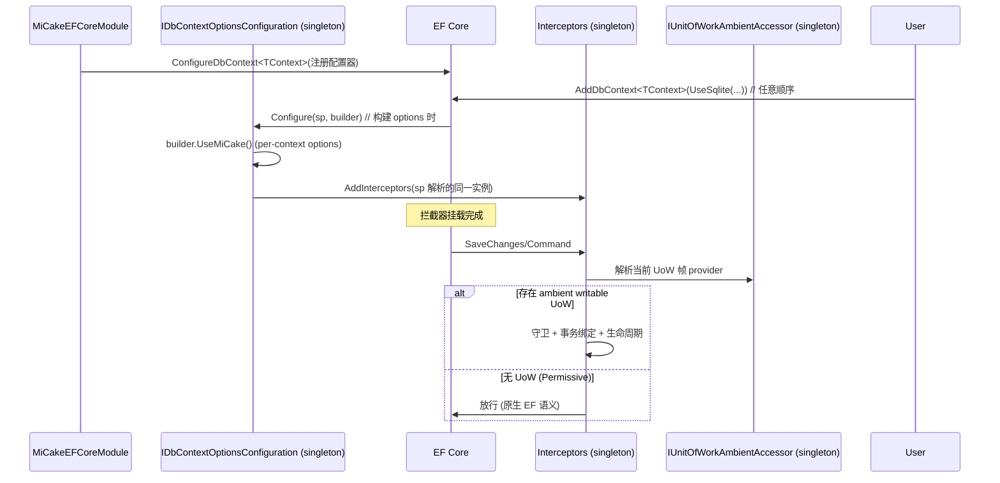

# Architecture Design: Interceptor Installation via ConfigureDbContext (方案 C 修订版)

## Overview

The current MiCake EF Core write pipeline requires users to install interceptors through `UseMiCakeInterceptors(IServiceProvider)` inside their `AddDbContext` delegate; the parameterless overload installs provider-less no-op interceptors, and the sample silently follows that path so its write guards are disabled. An earlier design (方案 C) attempted to register interceptors as DI services, but that premise is false — EF Core does not auto-discover `IInterceptor` services, verified by official docs and 22 failing tests. The authoritative fix, per EF Core 9+/10 documentation, is `ConfigureDbContext`/`IDbContextOptionsConfiguration<TContext>`: a reusable-component configuration hook that receives `IServiceProvider`, composes with `AddDbContext` (including pooling) in call order with non-conflicting options merged. This design installs interceptors inside such a configurator (explicit `AddInterceptors`, resolved from the provider), achieving user-transparent installation while respecting EF Core's mechanism.

**Guard policy is Permissive by default (and the only mode):** interceptors are always installed, but a direct DbContext write without an ambient writable UoW is passed through untouched (native EF Core semantics, e.g. implicit transaction); the write guard, transaction binding, and lifecycle pipeline apply only when an ambient writable UoW is active. MiCake never interferes with native EF Core usage outside a UoW.

## Architecture Decision Records

### ADR-1 (rewritten): Install interceptors via a `ConfigureDbContext` configurator

- **Status:** proposed
- **Context:** EF Core applies interceptors only through explicit `AddInterceptors`; DI-registered `IInterceptor` services are not discovered (proven by docs + 22 failing tests). The configurator hook `IDbContextOptionsConfiguration<TContext>` (registered via `ConfigureDbContext`) receives `IServiceProvider` and composes with `AddDbContext`/pooling.
- **Decision:** `MiCakeEFCoreModule` registers a singleton configurator per registered DbContext type via `ConfigureDbContext<TContext>`. The configurator's `Configure(sp, builder)` calls `builder.UseMiCake()` (installs the per-context options extension) and `builder.AddInterceptors(sp.GetRequiredService<...>(), ...)` resolving the two interceptor singletons. The same interceptor instances are reused across contexts (avoids the official `ManyServiceProvidersCreatedWarning`). Interceptors apply the Permissive policy: without an ambient writable UoW, SaveChanges and non-query commands pass through unguarded (native EF); with an ambient UoW, guards/binding/lifecycle apply. Read-only queries are never intercepted. No enum or option is introduced — Permissive is the single default behavior.
- **Alternatives:** DI `IInterceptor` service registration (rejected: EF Core does not discover them — proven). Framework taking over `AddDbContext` registration (rejected: blocks user control, risks `AddDbContextPool` conflicts). Keeping the `(sp)` overload (rejected: user must remember it; no-op trap persists).
- **Consequences:** Users no longer call any interceptor-install API; guards work automatically for every container-registered DbContext. Breaking: `IMiCakeInterceptorFactory`/static helper removed; `UseMiCakeInterceptors` overloads deleted. Risk: relies on EF Core 9+ `ConfigureDbContext` semantics — must be validated by the prototype first (see Verification Prerequisites).

### ADR-1a (new): Guard policy is Permissive by default — native EF writes pass through

- **Status:** proposed
- **Context:** The user requires that "启用 MiCake + 直接 DbContext 写" does not error and does not interfere with native EF Core usage.
- **Decision:** Interceptors are always installed, but a write without an ambient writable UoW passes through unguarded (native EF implicit transaction); only writes inside an ambient writable UoW are guarded, transaction-bound, and lifecycle-processed. This is the single default behavior — no enum, no option.
- **Alternatives:** Enforced-by-default with an opt-in Permissive enum (rejected: extra API surface; the user mandates Permissive as the only behavior).
- **Consequences:** Direct DbContext writes outside a UoW behave exactly like vanilla EF (no rollback/lifecycle guarantees — native semantics). Repository/UoW paths retain full enhancement.

### ADR-2 (kept): Keep `MiCakeSaveOperationOptionsExtension` for per-context state

- **Status:** accepted
- **Context:** `SaveOperationStateAccessor` needs per-DbContext isolation and EF pool-reset (`IResettableService`), which only works for services inside the options extension.
- **Decision:** The options extension stays as the carrier of the accessor and `MaxSaveCycles`; only interceptors move to the configurator.
- **Consequences:** Inheriting `MiCakeDbContext` stays no-friction (its `OnConfiguring` calls `UseMiCake()`); plain contexts get the extension from the configurator too.

### ADR-3 (rewritten): Delete all `UseMiCakeInterceptors` overloads; `UseMiCake()` installs options only

- **Status:** proposed
- **Context:** Interceptors no longer belong in options; the configurator installs them.
- **Decision:** Delete the parameterless, `(IServiceProvider)`, and internal 3-arg `UseMiCakeInterceptors` overloads (no transition shims — breaking window per R34). `UseMiCake()` remains as the options-only entry; `MiCakeDbContext.OnConfiguring` calls it.
- **Consequences:** All call sites migrate in the same change; external users of the overloads must migrate to `AddMiCake*` + `ConfigureDbContext` (automatic).

### ADR-4 (rewritten): Remove `IMiCakeInterceptorFactory` and static helper

- **Status:** proposed
- **Context:** The factory exists only to create interceptors with a provider; the configurator supersedes it.
- **Decision:** Remove the interface, implementation, and `MiCakeInterceptorFactoryHelper` in the same change; delete their tests.
- **Consequences:** Breaking; legacy tests removed or rewritten.

### ADR-5 (kept): `AddMiCakeApplication` rename out of scope

- **Status:** accepted
- **Decision:** Keep `AddMiCakeWithDefault` as-is; the rename is independent of interceptor installation.

## Module Design

| Module | Path | Responsibility | Dependencies |
|--------|------|----------------|--------------|
| EF Core Module | `MiCake.EntityFrameworkCore/Modules` | Register singleton configurator via `ConfigureDbContext`; register interceptors as singleton services | Core, UoW |
| EF Core Options Configurator | `MiCake.EntityFrameworkCore/Internal` (new `MiCakeDbContextOptionsConfigurator<TContext>`) | `Configure(sp, builder)`: `UseMiCake()` + `AddInterceptors(sp-resolved)` | EF Core options, interceptors |
| EF Core Write Pipeline | `MiCake.EntityFrameworkCore/Internal` | Stateless interceptors; Permissive guard; runtime coordinator/handler from UoW frame via accessor | MiCake UoW contracts |
| DbContext Extensions | `MiCake.EntityFrameworkCore/Extensions` | `UseMiCake()` options entry | EF Core options |
| ASP.NET Core Boundary | `MiCake.AspNetCore` | Unchanged | MiCake EF Core |

## Key Interfaces

### New internal contract

```csharp
internal sealed class MiCakeDbContextOptionsConfigurator<TContext> : IDbContextOptionsConfiguration<TContext>
    where TContext : DbContext
{
    public void Configure(IServiceProvider serviceProvider, DbContextOptionsBuilder optionsBuilder)
    {
        optionsBuilder.UseMiCake();   // per-context options extension
        optionsBuilder.AddInterceptors(
            serviceProvider.GetRequiredService<MiCakeEFCoreInterceptor>(),
            serviceProvider.GetRequiredService<MiCakeDbCommandInterceptor>());
    }
}
```

### New public API

```csharp
// DbContextExtensions
public static DbContextOptionsBuilder UseMiCake(this DbContextOptionsBuilder optionsBuilder);  // options only
```

### Deleted (no shims)

- `UseMiCakeInterceptors()` (parameterless)
- `UseMiCakeInterceptors(IServiceProvider)`
- internal 3-arg overload
- `IMiCakeInterceptorFactory`, `MiCakeInterceptorFactory`, `MiCakeInterceptorFactoryHelper`

### Changed internal contracts

```csharp
internal sealed class MiCakeEFCoreInterceptor : ISaveChangesInterceptor
{
    public MiCakeEFCoreInterceptor(ILogger<MiCakeEFCoreInterceptor> logger, IUnitOfWorkAmbientAccessor ambientAccessor);
}
internal sealed class MiCakeDbCommandInterceptor : DbCommandInterceptor
{
    public MiCakeDbCommandInterceptor(ILogger<MiCakeDbCommandInterceptor> logger, IUnitOfWorkAmbientAccessor ambientAccessor);
}
```

### Guard policy (Permissive)

- No ambient UoW + SaveChanges/non-query -> pass through (native EF).
- Ambient writable UoW -> guard + transaction binding + lifecycle.
- Reads -> never intercepted.

## Data Flow



## Usage Constraints

- Direct DbContext writes outside an ambient UoW behave exactly like vanilla EF (implicit transaction; no rollback/lifecycle guarantee). This is intentional (ADR-1a).
- Repository/UoW paths retain full enhancement (write guard, transaction binding, lifecycle, controlled re-entry) when an ambient writable UoW is active.
- `UseMiCake()` is the only options-level call; interceptors are installed automatically by the configurator — users never call an interceptor-install API.

## Verification Prerequisites (must pass before implementation)

1. **Prototype test** (in `MiCake.EntityFrameworkCore.Tests`): `ConfigureDbContext` + `AddDbContext(UseSqlite)` → interceptors attached (no `UseMiCakeInterceptors(sp)` call).
2. **Pooling**: `ConfigureDbContext` + `AddDbContextPool` → interceptors attached; pool-reset contract holds.
3. **Instance reuse**: same interceptor instances reused (no `ManyServiceProvidersCreatedWarning`).
4. **Composition**: configurator + user delegate compose per official order semantics; conflicting provider config resolved by call order.
5. **Permissive**: no-UoW SaveChanges passes through (native); UoW SaveChanges is guarded/bound.

These five checks are hard gates; if any fails, stop and re-validate the mechanism before proceeding.

## File Structure

### Modify

| Path | Intent |
|------|--------|
| `MiCakeEFCoreModule.cs` | Register singleton configurator via `ConfigureDbContext`; register interceptors as singleton services; remove factory registration |
| `MiCakeEFCoreInterceptor.cs` | ctor → accessor; Permissive pass-through for no-UoW writes |
| `MiCakeDbCommandInterceptor.cs` | ctor → accessor; Permissive pass-through for no-UoW commands |
| `DbContextExtensions.cs` | Add `UseMiCake()`; delete 3 overloads |
| `MiCakeDbContext.cs` | `OnConfiguring` → `UseMiCake()` |

### Create

| Path | Intent |
|------|--------|
| `MiCake.EntityFrameworkCore/Internal/MiCakeDbContextOptionsConfigurator.cs` | `IDbContextOptionsConfiguration<TContext>` implementation |

### Delete

| Path | Intent |
|------|--------|
| `IMiCakeInterceptorFactory.cs` | Removed |
| `MiCakeInterceptorFactory.cs` | Removed (impl + helper) |

### Tests

| Path | Intent |
|------|--------|
| New configurator prototype tests (×5 prerequisites) | Hard-gate validation |
| Fixture migrations to `UseMiCake()` (existing ~12 files) | Remove `(sp)` usage |
| Delete `MiCakeInterceptorFactoryTests`, `DbContextExtensionsEnhancedTests`, `NoServiceProviderDependencySummaryTests` | Legacy |
| Update guidance-message assertions in integration tests | `UseMiCake()` wording |
| `samples/Startup.cs` + README ×4 | Migrate to automatic installation |

## Implementation Guidelines

1. **Prototype first** (Verification Prerequisites) — do not touch production until the 5 gates pass.
2. Module registration → configurator → interceptor rewiring → extension changes → call-site migration → tests.
3. Delete retired APIs in the same change; no transition shims.

## Change Tracking

~18 files: 5 production modify, 1 create, 2 delete, ~10 test/sample/doc modify/delete.
