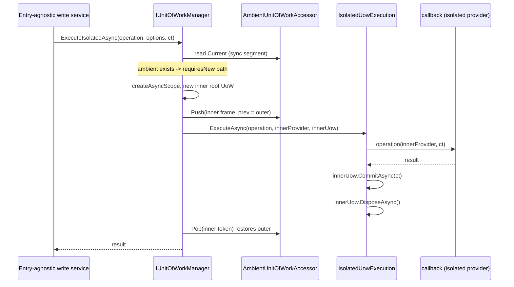
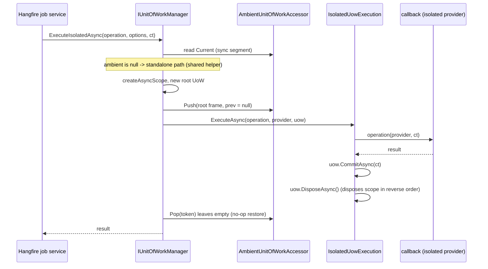

# Architecture Design: Context-Agnostic Isolated UoW Execution and Comprehension Guardrails

## Overview

Two independent user reports (MiCake `11.0.0-preview.2608081400`, ASP.NET Core + Hangfire) converge on one theme: the unit-of-work execution primitives are harder to use outside the HTTP request pipeline than inside it. `ExecuteRequiresNewAsync` requires an ambient UoW while `IStandaloneUnitOfWorkExecutor.ExecuteAsync` rejects one, so an entry-agnostic write service (used from both request handlers and background jobs) has no single call-site and must branch or open a throwaway anchor frame; the missing-ambient `InvalidOperationException` gives no remediation path, which turned a mis-selection into a production incident; and non-HTTP hosts have no documented boundary pattern comparable to `UnitOfWorkFilter`. This design (P0+P1 of the agreed roadmap) adds a context-agnostic isolated execution entry `ExecuteIsolatedAsync` to `IUnitOfWorkManager`, keeps both strict contracts unchanged as wiring self-checks, and ships the comprehension guardrails (decision table, actionable diagnostics, background-host guide) in the same change so the API addition cannot widen the existing terminology confusion. P2 (host-adapter packages such as `MiCake.Hangfire`) is explicitly out of scope and deferred.

Source: conversation (two user issue reports + `/mvt-bug-detect` diagnosis + `/mvt-consult` analysis) and prior artifacts of change `20260806-uow-transaction-reliability` (analysis.md, design.md ADR-001..011).

### Architectural Concerns

| Concern | Source-of-evidence | Priority |
|---|---|---|
| Context-agnostic single call-site for isolated writes | Issue Gap 1; entry-agnostic service repro; anchor-frame workaround in both reports | must |
| Contract stability: no behavior change to existing primitives | design.md ADR-003 (20260806 change); UnitOfWorkManagerTests strict assertions; preview-to-GA contract freeze expectation | must |
| Discoverability: actionable failure when no ambient UoW exists | `/mvt-bug-detect` confirmed Low bug; production incident in both reports | must |
| Comprehensibility: terminology must not grow more confusing | User question "will ExecuteIsolatedAsync make usage harder?"; issue 3.3 conceptual asymmetry | must |
| Ambient frame correctness (AsyncLocal sync-segment constraint) | UnitOfWorkManager.cs BeginAsync doc comment; UnitOfWorkFilter dependency on the same premise | must |
| Testable suspend/restore semantics across outcomes | analysis.md R46 composition matrix; issue section 8 offered test matrix | should |
| Documented boundary pattern for non-HTTP hosts | Issue Gap 2 (D2); missing docs section; only a migration note exists today | should |
| Multi-host integration packages (Hangfire/Quartz/...) | Issue Gap 2 (D1) | nice (deferred to P2) |

### Concern-to-Module Mapping

| Concern | Response | Owning module | Boundary impact |
|---|---|---|---|
| Context-agnostic single call-site | Add `ExecuteIsolatedAsync` (2 overloads) dispatching to the existing isolated cores | MiCake.DDD.Uow | Public contract +2 members (ADR-012) |
| Contract stability | Strict pair untouched; shared execution core reused, not rewritten | MiCake.DDD.Uow.Internal | None |
| Discoverability | Actionable missing-ambient message naming three remediation paths | MiCake.DDD.Uow.Internal | Diagnostic text only |
| Comprehensibility | Four-quadrant decision table + strict pair repositioned as wiring self-checks | README + docs | None |
| Ambient correctness | Frame push stays in the synchronous segment of `BeginAsync`/core methods; no async-boundary wrappers | MiCake.DDD.Uow.Internal | None |
| Testable semantics | ambient x outcome test matrix in unit + integration suites | src/tests | None |
| Non-HTTP host pattern | "Background jobs and non-HTTP hosts" guide with Hangfire reference implementations | docs | None |

## Architecture Decision Records

### ADR-012: Add context-agnostic `ExecuteIsolatedAsync` to `IUnitOfWorkManager`

- **Status**: accepted (stakeholder-confirmed 2026-10-08; breaking-change notice acknowledged)
- **Context**: Concerns "context-agnostic single call-site" and "comprehensibility". The two strict primitives have complementary preconditions (ambient required vs. ambient rejected), so entry-agnostic services must detect context in user code. Users already inject `IUnitOfWorkManager` for UoW work; the decision "which primitive fits my context" is runtime knowledge the framework already has. The prior change (analysis.md Assumptions) explicitly permits breaking public API changes with migration documentation, and the v11 preview window is the sanctioned time for API-shape changes.
- **Decision**: Add `Task ExecuteIsolatedAsync(...)` and `Task<TResult> ExecuteIsolatedAsync<TResult>(...)` to `IUnitOfWorkManager`. Semantics: always an isolated DI scope with its own root unit of work; with an ambient UoW, suspend and restore it exactly as `ExecuteRequiresNewAsync` does; without one, behave exactly as `IStandaloneUnitOfWorkExecutor` (restore is a documented no-op). This becomes the recommended default entry for isolated write blocks.
- **Alternatives**:
  - *New scoped service `IIsolatedUnitOfWorkExecutor`* — rejected: a third executor-shaped concept to inject and distinguish contradicts the comprehensibility concern more than adding a method to the existing facade.
  - *Extension method taking `IStandaloneUnitOfWorkExecutor` as a second parameter* — rejected: non-breaking but forces dual injection at every call site and hides behavior behind extensions.
  - *Relaxing `ExecuteRequiresNewAsync` to self-sufficient execution (issue option B)* — rejected: contradicts ADR-003's unambiguous-contract goal and test-locked behavior; "requiresNew" naming inherently references an outer unit of work, so no-ambient self-sufficiency is a semantic drift.
  - *Default interface method throwing `NotImplementedException`* — rejected: converts a compile-time contract into a runtime trap for custom implementers.
- **Consequences**:
  - Positive: one injected service, intent-based selection ("isolated write" vs "boundary frame"); user-side branching and anchor frames disappear; the strict pair keeps its self-check value.
  - Negative: source-breaking for third-party `IUnitOfWorkManager` implementers (add two members or delegate); the in-repo test fake must be updated. Mitigated by a migration note in `docs/Breaking-Changes-and-Migration-v2.md`.
  - Downstream cost: `/mvt-implement` updates the interface, manager, test fake, and matrix tests; docs updated in the same change (ADR-015).

### ADR-013: Keep both strict primitives unchanged as wiring self-checks

- **Status**: accepted
- **Context**: Concern "contract stability". `ExecuteRequiresNewAsync`'s throw-without-ambient and `IStandaloneUnitOfWorkExecutor`'s throw-with-ambient are documented, designed (design.md of `20260806-uow-transaction-reliability`, "to keep its contract unambiguous"), and test-locked. Teams that use the throw as an early wiring check rely on the strictness.
- **Decision**: Both contracts remain byte-for-byte identical in behavior. Their XML docs are repositioned as strict/wiring-check variants of `ExecuteIsolatedAsync`, with cross-references (`seealso`) among the three entries.
- **Alternatives**:
  - *Soften the standalone executor to accept an ambient UoW* — rejected: silently nesting a "standalone" boundary under an ambient frame changes commit visibility semantics and weakens the ownership model (ADR-001 of the prior change).
- **Consequences**: Positive: zero behavioral risk, existing tests stay green as regression proof. Negative: three entries remain in the API surface; mitigated by the decision table (ADR-015).

### ADR-014: Fix discoverability with an actionable message, not a new exception type

- **Status**: accepted
- **Context**: Concern "discoverability". The missing-ambient failure is a runtime-only signal; the current message states the precondition but no remediation. A dedicated exception type was requested by one report.
- **Decision**: Keep `InvalidOperationException`; rewrite the message to name the three remediation paths (establish a boundary frame with `BeginAsync`, use `ExecuteIsolatedAsync`, or use `IStandaloneUnitOfWorkExecutor.ExecuteAsync`). Mirror-update the standalone executor's message to mention `ExecuteIsolatedAsync` as well.
- **Alternatives**:
  - *Introduce `MissingAmbientUnitOfWorkException : InvalidOperationException`* — rejected: grows the public exception surface for marginal catch-specificity benefit; xunit `Assert.ThrowsAsync<T>` matches exact types, so the existing strict-pair regression tests (`ExecuteRequiresNewAsync_WithoutOuterUow_ShouldThrow`) would need re-basing, weakening them as contract locks. Reconsider only if users report a genuine catch-driven need.
- **Consequences**: Positive: two-line change, zero behavioral impact, incident root cause addressed. Negative: callers cannot catch a dedicated type; acceptable while the agnostic entry removes the common trigger.

### ADR-015: Ship comprehension guardrails in the same change as the API

- **Status**: accepted
- **Context**: Concern "comprehensibility" (explicitly raised by the stakeholder before this design). Adding `ExecuteIsolatedAsync` without renaming the conceptual landscape would trade one confusion for another. Requirement R43 of the prior analysis already demands exact documented semantics for every execution mode.
- **Decision**: Deliver together: (1) a four-quadrant decision table (boundary frame / shared nested / requiresNew isolated / standalone isolated) keyed on "do I want a transaction boundary or an isolated committed unit, and is there an ambient UoW"; (2) the "Background jobs and non-HTTP hosts" guide with two Hangfire reference patterns (server filter and async job base class) covering the AsyncLocal sync-segment constraint, opt-out, and the entry-agnostic helper shape; (3) `seealso` cross-links across the three API entries. P2 host-adapter packages remain deferred.
- **Alternatives**:
  - *Ship `MiCake.Hangfire` now* — rejected for this change: adds a dependency-surface and maintenance commitment before the documented pattern has real-world validation; the guide's reference implementation is the D2 deliverable and the test matrix de-risks a later package.
  - *Documentation-only (no API change)* — rejected: leaves the user-side branch/anchor boilerplate in place, which both reports identify as the core gap.
- **Consequences**: Positive: the API addition lands with the terminology map it needs; P2 has a validated reference to package later. Negative: docs maintenance joins the release checklist; guide language follows `document_output_language` (en-US) while the existing migration doc is zh-CN (see Change Tracking note).

## Module Design

| Module | Path | Responsibility | Dependencies |
|---|---|---|---|
| MiCake.DDD.Uow (public contracts) | `src/framework/MiCake/DDD/Uow` | Expose `ExecuteIsolatedAsync` on `IUnitOfWorkManager`; cross-referenced XML docs for all three execution entries | BCL only (unchanged) |
| MiCake.DDD.Uow.Internal (execution runtime) | `src/framework/MiCake/DDD/Uow/Internal` | Dispatch to the requiresNew or standalone isolated core; shared standalone start helper; actionable diagnostics | Microsoft.Extensions.DependencyInjection/Logging (unchanged) |
| Documentation surfaces | `src/framework/MiCake/README.md`, `docs/` | Decision table, background-host guide, migration note | none |
| Tests | `src/tests/MiCake.Tests`, `src/tests/MiCake.IntegrationTests` | Contract-lock and matrix coverage for the new entry; test-fake conformance | xunit (unchanged) |

Per-module interface notes:

- **MiCake.DDD.Uow**: `IUnitOfWorkManager` gains two members (see Key Interfaces). No other public type is added, renamed, or removed.
- **MiCake.DDD.Uow.Internal**: `UnitOfWorkManager` implements the dispatch; the standalone start path currently in `StandaloneUnitOfWorkExecutor.ExecuteCoreAsync` is extracted into a shared internal helper so both the executor and the manager's no-ambient branch run one implementation (frame push in the synchronous segment, `IsolatedUowExecution.ExecuteAsync` for commit/rollback/dispose and boundary-exception composition). `StandaloneUnitOfWorkExecutor` keeps its public contract and delegates to the shared helper.
- **Dependency direction**: unchanged; everything lives inside the `MiCake` package above `MiCake.Core`, below `MiCake.EntityFrameworkCore`. Layer check: passes (no Domain-to-Infrastructure inversion, no upward reference).

## Key Interfaces

### Context-agnostic isolated execution (new, on `IUnitOfWorkManager`)

```csharp
/// <summary>
/// Executes <paramref name="operation"/> in a fully isolated DI scope with its own root unit of work,
/// regardless of any ambient unit of work. Commits on success, rolls back on failure.
/// When an ambient UoW exists it is suspended and restored on every exit path
/// (success, failure, cancellation, commit failure, rollback failure); when none exists,
/// restoration is a no-op. The callback must resolve repositories and DbContexts from the
/// supplied provider. Recommended default entry for isolated write blocks in any host.
/// </summary>
Task ExecuteIsolatedAsync(
    Func<IServiceProvider, CancellationToken, Task> operation,
    UnitOfWorkOptions? options = null,
    CancellationToken cancellationToken = default);

Task<TResult> ExecuteIsolatedAsync<TResult>(
    Func<IServiceProvider, CancellationToken, Task<TResult>> operation,
    UnitOfWorkOptions? options = null,
    CancellationToken cancellationToken = default);
```

Semantics matrix (contract-level; must be stated verbatim in the XML docs):

| Ambient UoW at call time | DI scope | UoW created | On success | On failure | Ambient after exit |
|---|---|---|---|---|---|
| Present | Fresh isolated scope (caller's outer scope suspended) | Inner root, writable per `options` | Inner commit | Inner rollback (preserving the original exception) | Restored to the outer UoW (token pop) |
| Absent | Fresh isolated scope | Root, writable per `options` | Commit | Rollback (preserving the original exception) | Empty (pop is a no-op) |

`UnitOfWorkOptions` (incl. `IsReadOnly`, `IsolationLevel`, `InitializationMode`) applies to the inner unit of work exactly as in `ExecuteRequiresNewAsync`. Resolving `IUnitOfWorkManager` from the callback provider and reading `Current` returns the inner unit of work (same as ADR-003 behavior).

### Actionable missing-ambient diagnostic (modified text)

```text
ExecuteRequiresNewAsync requires an active outer unit of work.
Establish a boundary frame with IUnitOfWorkManager.BeginAsync(...) at the host edge,
use ExecuteIsolatedAsync(...) for context-agnostic isolated execution,
or use IStandaloneUnitOfWorkExecutor.ExecuteAsync(...) when no ambient unit of work exists.
```

The standalone executor's rejection message gains a matching mention of `ExecuteIsolatedAsync`.

### Unchanged strict contracts (regression-locked)

| Entry | Precondition | Failure on violation |
|---|---|---|
| `IUnitOfWorkManager.ExecuteRequiresNewAsync(...)` | Ambient UoW must exist | `InvalidOperationException` (message above) |
| `IStandaloneUnitOfWorkExecutor.ExecuteAsync(...)` | No ambient UoW may exist | `InvalidOperationException` (existing text, extended) |

### Four-quadrant decision table (docs deliverable)

| Intent | Ambient context | Use |
|---|---|---|
| Own a transaction boundary (host edge, long flow) | any | `BeginAsync` (nested = shared when ambient exists) |
| Isolated committed unit (write block) | known / strict discipline wanted | `ExecuteRequiresNewAsync` (needs ambient) / `IStandaloneUnitOfWorkExecutor` (needs none) |
| Isolated committed unit (write block) | unknown / entry-agnostic service | `ExecuteIsolatedAsync` (recommended default) |

### Background-host boundary reference shape (docs deliverable)

```csharp
// Pattern A: async job base class (preferred; no sync-over-async).
public async Task ExecuteJobAsync(Func<CancellationToken, Task> body, CancellationToken ct)
{
    await using var uow = await _unitOfWorkManager.BeginAsync(UnitOfWorkOptions.ReadOnly, ct);
    await body(ct);          // write blocks inside use ExecuteIsolatedAsync
    await uow.CommitAsync(ct);
}

// Pattern B: Hangfire IServerFilter mirroring UnitOfWorkFilter.
// The frame must be created in the synchronous segment of the filter callback
// (AsyncLocal constraint, same premise UnitOfWorkFilter relies on).
```

Both patterns document opt-out (notification-only jobs), cancellation, and retry semantics (rollback is typically empty because write blocks are individually idempotent and committed).

## Data Flow

### ExecuteIsolatedAsync with an ambient UoW (HTTP request path)



### ExecuteIsolatedAsync without an ambient UoW (background job path)



### Error paths (both flows)

| Failure point | Behavior (unchanged from `IsolatedUowExecution`) |
|---|---|
| Operation throws | Original exception captured (EDI); inner UoW rolled back with `CancellationToken.None`; original rethrown unless rollback also failed |
| Operation cancels | `OperationCanceledException` preserved through the same rollback path |
| Commit throws (`PartialUnitOfWorkCommitException`) | Terminal: no rollback attempted, no rolled-back events, original propagates as-is |
| Rollback also throws | `UnitOfWorkBoundaryException` with primary + rollback causes |
| Dispose throws | `UnitOfWorkBoundaryException` with cleanup cause; body success/failure preserved as `primaryEDI` |
| Any exit | Ambient token pop runs in `finally` (manager) and in `UnitOfWork.DisposeAsync`, restoring the outer frame or empty state deterministically |

## File Structure

### Create

| Path | Content |
|---|---|
| `docs/Background-Jobs-and-Non-HTTP-Hosts.md` | Non-HTTP host boundary guide: Hangfire patterns A/B, entry-agnostic helper shape, AsyncLocal sync-segment constraint, opt-out/cancel/retry semantics, test matrix (language: en-US per `document_output_language`) |

### Modify

| Path | Change |
|---|---|
| `src/framework/MiCake/DDD/Uow/IUnitOfWorkManager.cs` | +2 `ExecuteIsolatedAsync` members; XML docs with semantics matrix; `seealso` cross-links across all three entries |
| `src/framework/MiCake/DDD/Uow/Internal/UnitOfWorkManager.cs` | Dispatch implementation; actionable missing-ambient message |
| `src/framework/MiCake/DDD/Uow/Internal/StandaloneUnitOfWorkExecutor.cs` | Delegate to shared standalone start helper; extend rejection message |
| `src/framework/MiCake/DDD/Uow/Internal/IsolatedUowExecution.cs` | Gain the shared standalone start entry (or sibling internal static in the same folder) |
| `src/framework/MiCake/DDD/Uow/IStandaloneUnitOfWorkExecutor.cs` | XML `seealso` cross-links |
| `src/framework/MiCake/README.md` | Four-quadrant decision table; `ExecuteIsolatedAsync` section; strict pair repositioned as wiring self-checks |
| `docs/Breaking-Changes-and-Migration-v2.md` | Migration note: `IUnitOfWorkManager` gains two members (implementers add/delegate); new recommended default entry; non-breaking for consumers |
| `src/tests/MiCake.Tests/Uow/UnitOfWorkManagerTests.cs` | ambient x outcome matrix for `ExecuteIsolatedAsync`; keep strict-pair tests as contract locks |
| `src/tests/MiCake.Tests/Uow/StandaloneUnitOfWorkExecutorTests.cs` | Adjust for shared-helper extraction (behavior unchanged) |
| `src/tests/MiCake.IntegrationTests/Uow/UnitOfWorkCompositionMatrixTests.cs` | SQLite rows: agnostic execution with/without ambient, inner commit invisible to outer, ambient restored |
| `src/tests/MiCake.IntegrationTests/Filters/FilterOrderIntegrationTests.cs` | Test fake implements the two new members |

## Implementation Guidelines

1. **Establish the shared core first**: extract the standalone start path into the shared internal helper and re-point `StandaloneUnitOfWorkExecutor` at it before adding the dispatch. This keeps a single implementation of frame creation and makes the no-ambient branch a pure reuse (run the existing standalone tests after extraction — they must pass unchanged).
2. **Then add `ExecuteIsolatedAsync`**: interface members + `UnitOfWorkManager` dispatch (`Current != null ? requiresNewCore : standaloneCore`). Frame push must remain in the synchronous segment of the called methods (same as `BeginAsync` today); do not introduce async wrappers around frame creation.
3. **Update the in-repo test fake** (`FilterOrderIntegrationTests`) in the same commit as the interface change to keep the solution compiling.
4. **Docs and diagnostics** (can land with or immediately after): message rewrite, XML cross-links, README table, new guide, migration note.
5. **Test matrix ordering**: unit matrix first (fast feedback on both branches), then the SQLite composition rows. Reuse the naming pattern `ExecuteIsolatedAsync_{With|Without}Ambient_{Outcome}`. The full strict-pair suite (1124 tests as of the last baseline) must stay green as the behavior-preservation proof.
6. **Sequencing constraint**: do not release the API without the README decision table (ADR-015 couples them).

## Change Tracking

| Path | Action |
|---|---|
| `src/framework/MiCake/DDD/Uow/IUnitOfWorkManager.cs` | modify |
| `src/framework/MiCake/DDD/Uow/Internal/UnitOfWorkManager.cs` | modify |
| `src/framework/MiCake/DDD/Uow/Internal/StandaloneUnitOfWorkExecutor.cs` | modify |
| `src/framework/MiCake/DDD/Uow/Internal/IsolatedUowExecution.cs` | modify |
| `src/framework/MiCake/DDD/Uow/IStandaloneUnitOfWorkExecutor.cs` | modify |
| `src/framework/MiCake/README.md` | modify |
| `docs/Background-Jobs-and-Non-HTTP-Hosts.md` | create |
| `docs/Breaking-Changes-and-Migration-v2.md` | modify (note: existing file is zh-CN; appended migration section follows `document_output_language` en-US, flagged for maintainer preference) |
| `src/tests/MiCake.Tests/Uow/UnitOfWorkManagerTests.cs` | modify |
| `src/tests/MiCake.Tests/Uow/StandaloneUnitOfWorkExecutorTests.cs` | modify |
| `src/tests/MiCake.IntegrationTests/Uow/UnitOfWorkCompositionMatrixTests.cs` | modify |
| `src/tests/MiCake.IntegrationTests/Filters/FilterOrderIntegrationTests.cs` | modify |

Footprint: 12 files (1 create, 11 modify), 0 new modules. Exceeds the 5-file threshold: `/mvt-plan-dev` is recommended as the next step.

### Requirement Coverage

| Requirement (source) | Covered by |
|---|---|
| Issue Gap 1 / options A | ADR-012, Key Interfaces |
| Issue option C (actionable failure + docs section) | ADR-014, ADR-015 |
| Issue Gap 2 / D2 (reference implementation) | ADR-015, File Structure (new guide) |
| `/mvt-bug-detect` block 2 (confirmed Low bug) | ADR-014 |
| Comprehensibility guardrails (stakeholder question) | ADR-015, decision table |
| Prior analysis R43 (exact documented semantics) | Key Interfaces semantics matrix, decision table |
| Prior analysis R46 (composition matrix, ambient restoration) | Test rows in CompositionMatrixTests |
| Prior analysis R27 (explicit standalone boundary preserved) | ADR-013 |
| Migration guidance for breaking API change | Breaking-Changes note, ADR-012 consequences |
