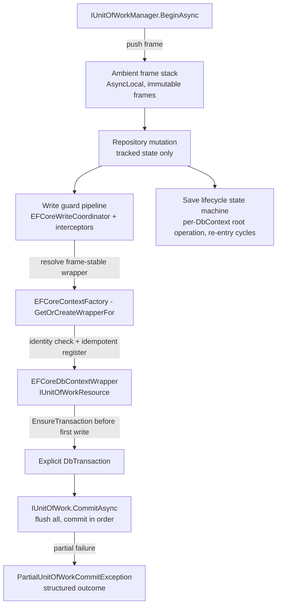

# MiCake Unit of Work v2 — Architecture and Usage Guide

Applies to the `uow_enhance` branch (change `20260806-uow-transaction-reliability`, t1-t8).
This guide replaces the pre-change UoW documentation and reflects the final public contract
after the breaking cleanup, including all review follow-up fixes.

## 1. Architecture Overview

### 1.1 Layers

| Layer | Package | Responsibility |
|---|---|---|
| UoW Contracts | `MiCake` (`DDD/Uow`) | Persistence ownership, ambient behavior, resource lifecycle, execution, outcomes, diagnostics |
| UoW Runtime | `MiCake` (`DDD/Uow/Internal`) | Root/shared state machine, ambient frames, standalone execution, resources, savepoints |
| EF Core Integration | `MiCake.EntityFrameworkCore` (`Uow`) | One DbContext instance per frame/type; EF resource wrapper; context registry |
| EF Core Write Pipeline | `MiCake.EntityFrameworkCore` (`Internal`) | Write guards, transaction activation/binding, save lifecycle state machine |
| EF Core Repository | `MiCake.EntityFrameworkCore` (`Repository`) | Tracked aggregate mutations; explicit physical/bulk operations; deterministic paging |
| ASP.NET Core Boundary | `MiCake.AspNetCore` (`Uow`) | Automatic request UoW; explicit read-only metadata |

Dependency direction is strictly inward:
`MiCake.Core -> MiCake -> MiCake.EntityFrameworkCore -> MiCake.AspNetCore`.

### 1.2 Guiding principles

1. **The UoW is the sole persistence owner.** Repository mutations only modify tracked
   state; durability happens exclusively through `FlushAsync` / `CommitAsync`.
2. **Every writable UoW uses an explicit transaction.** There is no non-transactional
   write mode (`OptimizeForSingleWrite` and `PersistenceStrategy` were removed). A
   transaction is activated before the first supported write.
3. **Read-only is enforced, not inferred.** Read-only UoWs reject every framework-mediated
   write before SQL execution. ASP.NET action-name inference is opt-in.
4. **`requiresNew` and standalone execution are fully isolated.** They own their DI scope,
   DbContext, ChangeTracker, and transaction, and restore the previous ambient frame.
5. **Multi-resource commit is explicitly best-effort.** No distributed ACID; partial
   commits are reported through structured outcomes.
6. **Ordinary writes require an ambient writable UoW.** Independent persistence is only
   available through `IStandaloneUnitOfWorkExecutor`.

### 1.3 Key mechanisms



- **Ambient frame stack**: a singleton `AsyncLocal` holds immutable frames
  `(Token, UnitOfWork, ServiceProvider, Previous)`. Frames are pushed in synchronous
  segments and restored via token-based compare-and-pop. Completed/disposed frames are
  self-healed on read.
- **Frame-stable context identity**: the same root UoW and DbContext type always resolve
  the same context and wrapper instance. A wrapper bound to another live root is rejected.
- **Resource anchoring**: every resolved wrapper is validated against the exact writing
  DbContext instance and idempotently registered with the UoW (shared anchor used by the
  write coordinator and the immediate initializer).
- **Save operation state machine**: per-DbContext root operation with immutable pre-save
  snapshots, re-entry suppression, bounded follow-up cycles (`MaxSaveCycles`, default 16),
  and a single cleanup owner.

## 2. Core Concepts

| Concept | Meaning |
|---|---|
| Root UoW | The application-visible operation boundary; owns resources and the final commit/rollback |
| Shared nested UoW | Child boundary that delegates resource ownership, flush, and savepoints to its root; its commit is a no-op, its rollback marks the root rollback-only |
| `requiresNew` UoW | Independent boundary created by `ExecuteRequiresNewAsync`; own DI scope, context, transaction; previous ambient UoW is restored on every exit path |
| Standalone execution | Explicit independent commit boundary via `IStandaloneUnitOfWorkExecutor`; rejects an existing ambient UoW |
| Read-only UoW | Boundary where writes are prohibited, not merely deferred |
| UoW resource | A persistence participant implementing `IUnitOfWorkResource` (prepare, activate, flush, commit, rollback, savepoints, disposal) |
| Controlled SaveChanges re-entry | A nested save from a lifecycle/domain-event handler inside the active save operation, suppressed and re-scanned into a bounded follow-up cycle in the same transaction |

## 3. Public API Reference

### 3.1 UoW contracts (`MiCake.DDD.Uow`)

```csharp
public interface IUnitOfWork : IDisposable, IAsyncDisposable
{
    Guid Id { get; }
    bool IsDisposed { get; }
    bool IsCompleted { get; }
    bool IsReadOnly { get; }
    bool HasActiveTransactions { get; }
    IsolationLevel? IsolationLevel { get; }
    IUnitOfWork? Parent { get; }

    Task<int> FlushAsync(CancellationToken cancellationToken = default);
    Task CommitAsync(CancellationToken cancellationToken = default);
    Task RollbackAsync(CancellationToken cancellationToken = default);
    Task MarkAsCompletedAsync(CancellationToken cancellationToken = default);

    Task<string> CreateSavepointAsync(string name, CancellationToken cancellationToken = default);
    Task RollbackToSavepointAsync(string name, CancellationToken cancellationToken = default);
    Task ReleaseSavepointAsync(string name, CancellationToken cancellationToken = default);

    event EventHandler<UnitOfWorkEventArgs>? OnCommitting;
    event EventHandler<UnitOfWorkEventArgs>? OnCommitted;
    event EventHandler<UnitOfWorkEventArgs>? OnRollingBack;
    event EventHandler<UnitOfWorkEventArgs>? OnRolledBack;
}

public interface IUnitOfWorkManager : IDisposable, IAsyncDisposable
{
    IUnitOfWork? Current { get; }

    Task<IUnitOfWork> BeginAsync(
        UnitOfWorkOptions? options = null,
        CancellationToken cancellationToken = default);

    Task ExecuteRequiresNewAsync(
        Func<IServiceProvider, CancellationToken, Task> operation,
        UnitOfWorkOptions? options = null,
        CancellationToken cancellationToken = default);

    Task<TResult> ExecuteRequiresNewAsync<TResult>(
        Func<IServiceProvider, CancellationToken, Task<TResult>> operation,
        UnitOfWorkOptions? options = null,
        CancellationToken cancellationToken = default);
}

public interface IStandaloneUnitOfWorkExecutor
{
    Task ExecuteAsync(
        Func<IServiceProvider, CancellationToken, Task> operation,
        UnitOfWorkOptions? options = null,
        CancellationToken cancellationToken = default);

    Task<TResult> ExecuteAsync<TResult>(
        Func<IServiceProvider, CancellationToken, Task<TResult>> operation,
        UnitOfWorkOptions? options = null,
        CancellationToken cancellationToken = default);
}

public sealed class UnitOfWorkOptions
{
    public bool IsReadOnly { get; set; }
    public IsolationLevel? IsolationLevel { get; set; }
    public TransactionInitializationMode InitializationMode { get; set; }
        = TransactionInitializationMode.Lazy;

    public static UnitOfWorkOptions Default { get; }
    public static UnitOfWorkOptions Immediate { get; }
    public static UnitOfWorkOptions ReadOnly { get; }
}

public interface IUnitOfWorkResource : IDisposable, IAsyncDisposable
{
    UnitOfWorkResourceId Id { get; }
    string ResourceType { get; }
    bool HasActiveTransaction { get; }
    bool SupportsSavepoints { get; }

    void Prepare(UnitOfWorkResourceContext context);
    void EnsureTransaction();
    ValueTask EnsureTransactionAsync(CancellationToken cancellationToken = default);
    ValueTask<int> FlushAsync(CancellationToken cancellationToken = default);
    ValueTask CommitAsync(CancellationToken cancellationToken = default);
    ValueTask RollbackAsync(CancellationToken cancellationToken = default);
    ValueTask CreateSavepointAsync(string name, CancellationToken cancellationToken = default);
    ValueTask RollbackToSavepointAsync(string name, CancellationToken cancellationToken = default);
    ValueTask ReleaseSavepointAsync(string name, CancellationToken cancellationToken = default);
}
```

Behavioral notes:

- `FlushAsync` flushes every registered resource in deterministic registration order and
  returns the total affected rows. It does not commit, does not complete the UoW, and
  does not raise commit events. On failure the UoW becomes rollback-only.
- `CommitAsync` on a shared nested UoW completes only (no physical commit, no events).
  On a read-only or empty UoW it completes without a physical commit.
- Commit is best-effort across resources; a failure produces
  `PartialUnitOfWorkCommitException` with per-resource `CommitState` / `RollbackState`
  (see section 6.3). The UoW is NOT reported as rolled back after any resource committed.
- Savepoint methods throw `NotSupportedException` before changing state when
  `SupportsSavepoints` is false (the EF Core resource reports `false`).
- `ExecuteRequiresNewAsync` throws `InvalidOperationException` when no live outer UoW
  exists; the callback must resolve repositories/DbContexts from the supplied provider.
- `IStandaloneUnitOfWorkExecutor` rejects an existing ambient UoW.
- Resource IDs are collision-safe GUIDs (`UnitOfWorkResourceId`), never hash-code strings.

### 3.2 Outcome and exception types

```csharp
public readonly record struct UnitOfWorkResourceId(Guid Value);

public enum UnitOfWorkResourceCommitState
{
    Pending,
    Committed,
    Failed,
    RolledBack,
    RollbackFailed
}

public sealed record UnitOfWorkResourceOutcome(
    UnitOfWorkResourceId ResourceId,
    string ResourceType,
    UnitOfWorkResourceCommitState State);

public sealed record UnitOfWorkCommitOutcome(
    Guid UnitOfWorkId,
    IReadOnlyList<UnitOfWorkResourceOutcome> Resources);
```

- `PartialUnitOfWorkCommitException` — carries the structured `UnitOfWorkCommitOutcome`,
  the commit failures, and the rollback failures. Raised only when at least one resource
  committed; otherwise the original commit failure is rethrown (or a
  `UnitOfWorkBoundaryException` when rollback also failed).
- `UnitOfWorkBoundaryException` — carries the primary exception plus rollback/cleanup
  failures for boundary operations.
- `SaveChangesReentryException` — thrown when a re-entry request makes no progress or the
  `MaxSaveCycles` limit is reached; the UoW is left rollback-only.

### 3.3 EF Core contracts (`MiCake.EntityFrameworkCore`)

```csharp
public interface IEFCoreContextFactory<TDbContext> where TDbContext : DbContext
{
    /// Gets the frame-stable DbContext for the current unit of work.
    TDbContext GetDbContext();

    /// Gets or creates the EF Core resource wrapper for the given DbContext instance in
    /// the current unit of work. A wrapper already registered for this context instance
    /// is reused, so the same context never becomes a second unit-of-work resource.
    EFCoreDbContextWrapper GetOrCreateWrapperFor(DbContext context);
}

public interface IEFCorePhysicalOperationExecutor<TDbContext> where TDbContext : DbContext
{
    Task<int> ExecuteDeleteAsync<TEntity>(
        Expression<Func<TEntity, bool>> predicate,
        CancellationToken cancellationToken = default)
        where TEntity : class;
}
```

Registration:

```csharp
builder.UseEFCore<MyDbContext>();                       // MiCake module integration
// or, when wiring manually:
services.AddUowCoreServices(typeof(MyDbContext));        // internal extension, per context type
```

- The public factory surface is exactly `IEFCoreContextFactory<TDbContext>`; the
  non-generic runtime view used internally is not part of the public contract, and custom
  implementations are adapted to it automatically. A custom implementation only needs the
  two public methods above.
- `MiCakeEFCoreOptions` — `BypassUnitOfWorkCheck` (allows context access without a UoW,
  read-only guidance; default false) and `MaxSaveCycles` (default 16).

### 3.4 ASP.NET Core contract (`MiCake.AspNetCore`)

```csharp
[AttributeUsage(AttributeTargets.Class | AttributeTargets.Method)]
public sealed class UnitOfWorkAttribute : Attribute
{
    public bool IsReadOnly { get; set; }
    public IsolationLevel? IsolationLevel { get; set; }
}

[AttributeUsage(AttributeTargets.Class | AttributeTargets.Method)]
public sealed class DisableUnitOfWorkAttribute : Attribute
{
}
```

`MiCakeAspNetUowOptions` (via `MiCakeAspNetOptions.UnitOfWork`):

- `EnableAutoUnitOfWork` — default `true`.
- `EnableReadOnlyActionNameInference` — default `false` (opt-in).
- `ReadOnlyActionKeywords` — default `["Find", "Get", "Query", "Search"]`.

Read-only resolution priority: explicit `[UnitOfWork(IsReadOnly = ...)]` > opt-in
action-name inference > writable default. `[DisableUnitOfWork]` always wins.

## 4. Usage Guide

### 4.1 Fast start — manual UoW

```csharp
public class BookService
{
    private readonly IUnitOfWorkManager _unitOfWorkManager;
    private readonly IRepository<Book, Guid> _bookRepository;

    public BookService(IUnitOfWorkManager uowManager, IRepository<Book, Guid> bookRepository)
    {
        _unitOfWorkManager = uowManager;
        _bookRepository = bookRepository;
    }

    public async Task CreateBookAsync(string title)
    {
        await using var uow = await _unitOfWorkManager.BeginAsync();

        await _bookRepository.AddAsync(new Book(Guid.NewGuid(), title));
        // optionally: await uow.FlushAsync();  // for generated keys, before commit
        await uow.CommitAsync();                 // commits the explicit transaction
    }
}
```

- No ambient UoW -> repository mutations are tracked but never saved; a direct
  `SaveChangesAsync` without a UoW is rejected before SQL.
- Failure path: `await uow.RollbackAsync()` (or let `await using` disposal roll back).

### 4.2 Generated identity (database-generated keys)

```csharp
await using var uow = await _unitOfWorkManager.BeginAsync();
var book = new Book(title: "New");           // Id generated by the database
await _bookRepository.AddAsync(book);
await uow.FlushAsync();                      // activates the transaction and writes
var generatedId = book.Id;                   // now populated
await uow.CommitAsync();
```

### 4.3 `requiresNew` — isolated inner boundary

```csharp
await using var outer = await uowManager.BeginAsync();
// ... outer tracked changes ...

// Inner UoW: own DI scope, own DbContext, own transaction.
await uowManager.ExecuteRequiresNewAsync(async (innerProvider, ct) =>
{
    var repo = innerProvider.GetRequiredService<IRepository<Book, Guid>>();
    await repo.AddAsync(new Book(Guid.NewGuid(), "isolated"), ct);
    // inner commit happens automatically on success; rollback on failure
});

// The previous ambient UoW (outer) is restored on every exit path.
```

- The callback MUST resolve persistence services from `innerProvider`; capturing outer
  scoped services is detected by ownership validation before a write.
- Throws `InvalidOperationException` when no outer UoW exists — use standalone execution
  for independent work.

### 4.4 Standalone execution — no ambient UoW required

```csharp
var executor = serviceProvider.GetRequiredService<IStandaloneUnitOfWorkExecutor>();
await executor.ExecuteAsync(async (provider, ct) =>
{
    var repo = provider.GetRequiredService<IRepository<Book, Guid>>();
    await repo.AddAsync(new Book(Guid.NewGuid(), "background"), ct);
});
```

Rejects an existing ambient UoW; owns scope -> UoW -> disposal in reverse order.

### 4.5 Read-only UoW

```csharp
await using var uow = await uowManager.BeginAsync(UnitOfWorkOptions.ReadOnly);
// reads are fine; ANY framework-mediated write throws InvalidOperationException
```

ASP.NET Core:

```csharp
[HttpGet("{id}")]
[UnitOfWork(IsReadOnly = true)]
public async Task<IActionResult> Get(Guid id) { ... }

// Opt-out for a specific action:
[HttpPost("raw")]
[DisableUnitOfWork]
public async Task<IActionResult> Raw() { ... }
```

### 4.6 Lazy vs Immediate initialization

```csharp
// Lazy (default): the transaction is activated before the first supported write.
await using var uow = await uowManager.BeginAsync(UnitOfWorkOptions.Default);

// Immediate: every registered DbContext resource is resolved, validated, registered,
// and its transaction activated at UoW creation time.
await using var uow = await uowManager.BeginAsync(UnitOfWorkOptions.Immediate);
```

Immediate mode enumerates one internal factory view per registered DbContext type;
duplicate registrations are deduplicated, and custom factory wrappers are validated
against the resolved context and registered with the UoW before activation.

### 4.7 Physical delete, bulk, raw SQL

```csharp
// Physical delete: bypasses aggregate lifecycle (loading, audit, soft delete, domain
// events) but stays INSIDE the UoW transaction. Requires an ambient writable UoW.
var executor = provider.GetRequiredService<IEFCorePhysicalOperationExecutor<AppDbContext>>();
await executor.ExecuteDeleteAsync<Book>(b => b.PublishedAt < cutoff);

// EF bulk / raw SQL are guarded and transaction-bound as well:
await context.Books.Where(b => b.Price == 0).ExecuteUpdateAsync(s => s.SetProperty(b => b.Price, 1));
await context.Database.ExecuteSqlRawAsync("DELETE FROM \"Books\" WHERE ...");
```

### 4.8 Paging

- Every paging path establishes a total order before `Skip`/`Take`.
- Without caller sorting: ascending by every primary-key property in EF model order.
- With caller sorting: caller direction preserved, missing primary-key properties appended
  as ascending final `ThenBy` clauses.
- Keyless entity types throw `InvalidOperationException` (deterministic paging is
  impossible without a key).

### 4.9 Domain events vs integration events

- **Domain events** raised by aggregates are dispatched inside the UoW transaction during
  commit; a handler failure aborts the commit and rolls back the whole UoW.
- **Integration events** must be published only after the transaction durably commits
  (after `CommitAsync` succeeds, or from the `OnCommitted` hook). Reliable delivery is
  application-owned (e.g. an outbox stored in the same transaction).

### 4.10 Multi-resource and partial commit

```csharp
try
{
    await uow.CommitAsync();
}
catch (PartialUnitOfWorkCommitException ex)
{
    foreach (var outcome in ex.Outcome.Resources)
    {
        // outcome.State tells you Committed / Failed / RolledBack / RollbackFailed
    }
    // The UoW is NOT rolled back as a whole; dispose it to release remaining resources.
}
```

## 5. Configuration and Startup Validation

| Registration | Requirement |
|---|---|
| DbContext | scoped or pooled (`AddDbContext` / `AddDbContextPool`); missing, singleton, or transient fail startup with context-specific guidance |
| Execution strategy | `RetriesOnFailure = true` is rejected for ambient writable UoWs (requires an application-owned replayable boundary) |
| `IUnitOfWorkAmbientAccessor` | framework-provided singleton; hosts must NOT register a replacement (would split ambient state between interceptors and the manager) |
| Interceptors | use the DI overload `UseMiCakeInterceptors(sp)` inside `AddDbContext`; the provider-less static path is a legacy no-op |

```csharp
services.AddDbContext<AppDbContext>((sp, opt) =>
{
    opt.UseSqlite(connectionString);
    opt.UseMiCakeInterceptors(sp);
});
```

## 6. Diagnostics

- Structured logs correlate `UnitOfWorkId`, `ResourceId`, DbContext type, operation kind,
  and lifecycle phase.
- Logs never contain SQL parameter values, entity property values, or connection strings.
- Stable categories start with `MiCake`; the write pipeline logs transaction activation
  and command binding at Debug level.

## 7. Migration Guide (old -> new)

| Removed / changed API | Replacement |
|---|---|
| `IRepository.SaveChangesAsync()` | `IUnitOfWork.CommitAsync()` on the ambient UoW |
| `IRepository.AddAndReturnAsync(...)` | `AddAsync(...)` + `IUnitOfWork.FlushAsync()` where a generated key is required |
| `IRepository.ClearChangeTrackingAsync()` | removed (no replacement) |
| `PersistenceStrategy` / `OptimizeForSingleWrite` | removed; every writable UoW uses explicit transactions |
| `UnitOfWorkOptions.Timeout` | removed (it previously had no runtime effect); use EF/provider command timeout configuration |
| `BeginAsync(requiresNew: true)` | `ExecuteRequiresNewAsync(callback)`; resolve services from the callback provider |
| `IDbContextWrapper` | `IUnitOfWorkResource` (provider integration contract) |
| `UnitOfWorkAttribute.InitializationMode` / `CreateOptions()` / `IsUowEnabled` | removed; attribute is sealed with `IsReadOnly` + `IsolationLevel?` |
| Non-generic `IEFCoreContextFactory` / `IEFCoreAnchoredContextFactory` / `GetDbContextWrapper()` | merged into `IEFCoreContextFactory<TDbContext>` (`GetDbContext()` + `GetOrCreateWrapperFor(DbContext)`) |
| No-UoW direct save | rejected before SQL; use an ambient writable UoW or `IStandaloneUnitOfWorkExecutor` |

## 8. Common Pitfalls

1. **Forgetting the UoW**: any framework-mediated write without an ambient writable UoW
   throws before SQL executes. Begin a UoW first (or use standalone execution).
2. **Capturing outer scoped services in a `requiresNew` callback**: resolve from the
   callback's `IServiceProvider`; ownership validation rejects captured outer contexts.
3. **Read-only write attempts**: they fail fast with the UoW id in the message — do not
   rely on inference for correctness; use explicit `IsReadOnly` metadata.
4. **Multiple `AddUowCoreServices` calls for the same context**: registrations are
   idempotent now, but keep a single `UseEFCore<TDbContext>()` call per context type.
5. **Custom factory implementations**: only `GetDbContext()` and
   `GetOrCreateWrapperFor(DbContext)` are required; the framework adapts the internal
   runtime view. The wrapper must wrap the exact context that performs the work.
6. **Bypass mode**: `BypassUnitOfWorkCheck = true` returns a standalone wrapper without
   UoW integration — intended for read-only access in filters/middleware only.
7. **Performance baseline**: run on demand with
   `dotnet test src/tests/MiCake.IntegrationTests --filter Category=Performance`; the
   regular suite excludes these scenarios.
