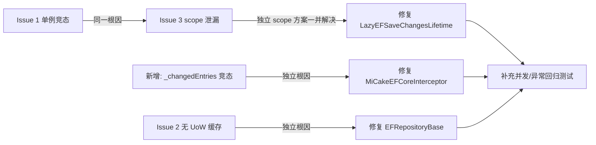

# MiCake Framework 问题复核结论与修复方案

> 来源：对 `micake-framework-issues.md` 报告内容的深度复核
> 复核方式：逐行代码审查（未修改源码）
> 复核日期：2026-08-06
> 适用版本：MiCake 10.0.0（`dev` 分支源码）

---

## 1. 复核结论总览

| 编号 | 问题 | 复核判定 | 严重度 | 修复优先级 |
|------|------|----------|--------|------------|
| Issue 1 | `LazyEFSaveChangesLifetime` 单例 scope 竞态 | **确认存在** | Critical | P0 |
| Issue 2 | 无 UoW 时 `DbContext` 属性每次访问新建实例 | **条件成立**（transient/自定义 factory 触发） | Warning | P2 |
| Issue 3 | Pre-save 异常路径 scope 泄漏 | **确认存在** | Critical | P0（与 Issue 1 一并修复） |
| 新增 1 | `MiCakeEFCoreInterceptor._changedEntries` 实例字段竞态 | **条件成立**（pooling/共享 options 触发） | Warning | P1 |
| Appendix A | `new` 方法隐藏 | **原文技术结论不准确**，设计建议保留 | Minor | P3 |

### 修复联动关系



---

## 2. Issue 1：`LazyEFSaveChangesLifetime` 单例 scope 竞态（Critical / P0）

### 2.1 问题定位

| 位置 | 说明 |
|------|------|
| `src/framework/MiCake.EntityFrameworkCore/Modules/MiCakeEFCoreModule.cs` L38 | `services.TryAddSingleton<IEFSaveChangesLifetime, LazyEFSaveChangesLifetime>()` —— 单例注册 |
| `src/framework/MiCake.EntityFrameworkCore/Internal/LazyEFSaveChangesLifetime.cs` L21 | `private IServiceScope? _currentScope;` —— 无同步保护的实例字段 |
| 同上 L93-104 | `ExecuteWithScopeAsync`：pre-save 写 `_currentScope`；post-save 读 `_currentScope` 并在 finally 中 dispose + 置 null |

### 2.2 根因

单例实例持有**跨请求共享的可变状态** `_currentScope`，pre-save 与 post-save 之间隔着 EF 数据库保存的 await 点。并发请求交错时：

1. 请求 A `BeforeSaveChanges` → `_currentScope = scopeA`
2. 请求 B `BeforeSaveChanges` → `_currentScope = scopeB`（覆盖 A）
3. 请求 A `AfterSaveChanges` → 读到 `scopeB`，将其 dispose 并置 `null`
4. 请求 B `AfterSaveChanges` → `_currentScope` 为 `null` → 新建 scope；或读到已被 A 释放的 scope → `ObjectDisposedException`

后果：

- 请求之间 service provider 错配（审计、事件 handler 拿到错误的 scoped 服务）。
- scope 泄漏（被覆盖的 scopeA 永不释放）。
- 并发写请求下偶发 `ObjectDisposedException`（HTTP 500）。

### 2.3 修复方案（推荐）：pre/post 独立异步 scope

删除 `_currentScope` 字段，每次调用独立创建并释放 scope：

```csharp
private async Task ExecuteWithScopeAsync(
    IEnumerable<EntityEntry> entityEntries,
    Func<IReadOnlyList<EntityEntry>, IServiceProvider, CancellationToken, Task> processor,
    bool isPreSave,
    CancellationToken cancellationToken)
{
    var entries = entityEntries as IReadOnlyList<EntityEntry> ?? [.. entityEntries];
    if (entries.Count == 0)
        return;

    // 每个阶段独立 scope，避免跨请求共享状态（修复单例竞态 + scope 泄漏）
    await using var scope = _serviceScopeFactory.CreateAsyncScope();
    await processor(entries, scope.ServiceProvider, cancellationToken);
}
```

选型理由：

- 内置 handler（`AuditRepositoryLifetime`、`SoftDeletionRepositoryLifetime`、`DomainEventDispatchLifetime`、`DomainEventCleanupLifetime`）均为无跨阶段共享状态的独立实现，pre/post 不依赖同一 scope 实例。
- 公开接口 `IEFSaveChangesLifetime` 未承诺 pre/post 共享同一 DI scope。
- 顺带彻底解决 Issue 3（异常路径 scope 泄漏）。
- `CreateAsyncScope` 可正确释放实现了 `IAsyncDisposable` 的 scoped service（原 `CreateScope` 只同步 dispose）。

### 2.4 备选方案：按 DbContext 关联 scope（仅当需保留跨阶段共享语义时）

1. 使用 `ConcurrentDictionary<DbContext, AsyncServiceScope>` 存储 scope，键取自 `EntityEntry.Context`。
2. Before 创建并加入字典；After 原子移除并释放。
3. Before handler 异常时立即移除并释放。
4. 在 `SaveChangesFailed` / `SaveChangesCanceled` 回调中清理。
5. 通过内部 cleanup 接口实现，避免修改公开 `IEFSaveChangesLifetime` 接口。

不建议 `AsyncLocal<IServiceScope>`：无法可靠表达"一次独立的 DbContext 保存操作"，嵌套保存、`ExecutionContext` 分支与失败路径均需额外管理，复杂度高于独立 scope 方案。

---

## 3. Issue 3：Pre-save 异常路径 scope 泄漏（Critical / P0）

### 3.1 问题定位

`LazyEFSaveChangesLifetime.cs` L96-104：`finally` 块仅在 `!isPreSave` 分支执行 `scope.Dispose()` 与 `_currentScope = null`。

### 3.2 触发路径

| 路径 | 是否泄漏 | 说明 |
|------|----------|------|
| Pre-save handler 抛异常 | 是 | scope 未释放，`_currentScope` 残留死引用 |
| EF 数据库保存失败 | 是 | 不进入 `SavedChangesAsync`，scope 未释放 |
| 请求取消（CancellationToken） | 是 | 同上 |

### 3.3 影响修正（相对原报告）

- 下一次**正常**保存会先执行 Before 并覆盖 `_currentScope`，通常不会直接复用旧 scope；原报告"下一次 post-save 复用旧 scope"不成立。
- 但 scope 泄漏本身成立，且残留引用长期占用资源。

### 3.4 修复方案

采用 2.3 的独立 scope 方案即一并修复。若采用备选方案，则需在上述异常/失败/取消路径中显式清理。

---

## 4. 新增问题：`MiCakeEFCoreInterceptor._changedEntries` 竞态（Warning / P1）

### 4.1 问题定位

`src/framework/MiCake.EntityFrameworkCore/Internal/MiCakeEFCoreInterceptor.cs` L23：

```csharp
private IReadOnlyList<EntityEntry> _changedEntries = [];
```

- `SavingChangesAsync` 写入（L132），`SavedChangesAsync` / `SaveChangesFailed` 读取并清空（L84/L96）。
- 无任何同步保护。

### 4.2 触发条件（需收窄判断）

| 场景 | 是否跨请求共享拦截器 | 竞态风险 |
|------|----------------------|----------|
| 普通 scoped `AddDbContext`，`MiCakeDbContext.OnConfiguring` 创建拦截器 | 通常否（每 context 独立拦截器，且同一 DbContext 不并发 SaveChanges） | 低 |
| `AddDbContextPool` | options/interceptor 被多个租用 context 共享 | **高** |
| 显式把 interceptor 注册为 Singleton / 多 options 复用同一实例 | 是 | **高** |

后果：请求 A 的 post-save 可能读到请求 B 的 entries，对错误实体集合执行 `IRepositoryPostSaveChanges`（审计/事件 handler 收到错误实体）。

### 4.3 修复方案

删除实例字段状态，改为按 `DbContext` 键控的并发字典（成功/失败/取消回调统一清理）：

```csharp
// 替代 _changedEntries 实例字段
private static readonly ConcurrentDictionary<DbContext, IReadOnlyList<EntityEntry>> s_pendingEntries = new();

public async ValueTask<InterceptionResult<int>> SavingChangesAsync(...)
{
    ...
    if (entries.Count > 0)
    {
        s_pendingEntries[eventData.Context] = entries;
        try
        {
            await _saveChangesLifetime.BeforeSaveChangesAsync(entries, cancellationToken);
        }
        catch
        {
            s_pendingEntries.TryRemove(eventData.Context, out _);
            throw;
        }
    }
    return result;
}

public async ValueTask<int> SavedChangesAsync(...)
{
    try
    {
        if (s_pendingEntries.TryRemove(eventData.Context, out var entries) && entries.Count > 0)
        {
            await _saveChangesLifetime.AfterSaveChangesAsync(entries, cancellationToken);
        }
    }
    ...
}

public void SaveChangesFailed(...)
{
    s_pendingEntries.TryRemove(eventData.Context, out _);
    s_ownerLookupCache.Clear();
}
```

> 注意：不能在 post-save 阶段重新扫描 `ChangeTracker` 获取 entries——保存成功后状态已变为 `Unchanged`，无法还原原始变更集合，因此必须保留 SaveChanges 开始时捕获的列表。

---

## 5. Issue 2：无 UoW 时 DbContext 每次访问新建实例（Warning / P2）

### 5.1 问题定位

`src/framework/MiCake.EntityFrameworkCore/Repository/EFRepositoryBase.cs` L104-115：

```csharp
private CacheContext GetOrCreateCacheContext()
{
    var currentUow = Dependencies.UnitOfWorkManager.Current;

    // If no active UoW, create a temporary cache without storing it
    if (currentUow == null)
    {
        var tempCache = CreateCacheContext(Guid.Empty);
        return tempCache;   // 不入字典，每次访问新建
    }
    ...
}
```

另有两个方法直接绕过缓存：

```csharp
protected Task<TDbContext> GetDbContextAsync(...)
    => Task.FromResult(Dependencies.ContextFactory.GetDbContext());   // 绕过缓存

protected Task<DbSet<TEntity>> GetDbSetAsync(...)
{
    var context = Dependencies.ContextFactory.GetDbContext();          // 绕过缓存
    return Task.FromResult(context.Set<TEntity>());
}
```

### 5.2 触发条件（需收窄判断）

| 注册方式 | 同一 DI scope 内多次解析 | 实际风险 |
|----------|--------------------------|----------|
| 默认 `AddDbContext`（scoped） | 同一实例 | 被掩盖 |
| `AddDbContextPool` | 同一 scope 内同一租用实例 | 被掩盖（不会每次更换） |
| **`AddDbContext(..., ServiceLifetime.Transient)`** | **每次不同实例** | **Add 与 SaveChanges 分叉，丢失写入** |
| 自定义 context factory 不保证 scope 内身份稳定 | 每次不同实例 | 同上 |

### 5.3 修复方案

让 `Guid.Empty` 成为 repository 实例内无 UoW 缓存键，统一走现有字典 + 双重检查逻辑：

```csharp
private CacheContext GetOrCreateCacheContext()
{
    var currentUow = Dependencies.UnitOfWorkManager.Current;
    var cacheKey = currentUow?.Id ?? Guid.Empty;   // 无 UoW 时使用固定 fallback 键

    _cacheLock.EnterReadLock();
    try
    {
        if (_contextCache.TryGetValue(cacheKey, out var cached))
            return cached;
    }
    finally
    {
        _cacheLock.ExitReadLock();
    }

    _cacheLock.EnterWriteLock();
    try
    {
        if (_contextCache.TryGetValue(cacheKey, out var cached))
            return cached;

        var newCache = CreateCacheContext(cacheKey);
        _contextCache[cacheKey] = newCache;

        // 仅在存在真实 UoW 时订阅清理事件（避免 Guid.Empty 键被 UoW 事件误清理）
        if (currentUow != null && !_subscribedUowIds.Contains(cacheKey))
        {
            SubscribeToUowCleanup(currentUow, cacheKey);
            _subscribedUowIds.Add(cacheKey);
        }

        return newCache;
    }
    finally
    {
        _cacheLock.ExitWriteLock();
    }
}
```

同时修正异步方法，统一走缓存：

```csharp
protected Task<TDbContext> GetDbContextAsync(CancellationToken cancellationToken = default)
{
    return Task.FromResult(GetOrCreateCacheContext().DbContext);
}

protected Task<DbSet<TEntity>> GetDbSetAsync(CancellationToken cancellationToken = default)
{
    return Task.FromResult(GetOrCreateCacheContext().DbSet);
}
```

注意事项：

- 无 UoW 时 `DbContext` 由 DI 容器管理生命周期（scoped 注册下随请求 scope 释放），repository 缓存不应 dispose 它——现有 `shouldDisposeDbContext: false` 语义保持不变。
- `Guid.Empty` 键只在 repository 实例内部缓存一次，跨请求无共享（repository 为 scoped），无新增竞态。

---

## 6. Appendix A：`new` 方法隐藏（Minor / P3）

### 6.1 原报告技术结论修正

原报告称"接口调用会选择派生类的 `new` 方法"。C# 规则实际如下：

- 基类已实现接口、派生类仅用 `new` 隐藏方法（未重新声明接口）时，**接口调用仍映射到基类实现**。
- 仅当派生类显式重新实现接口（重新列出接口成员）时，接口映射才更新到派生类成员。

```csharp
IRepository repo = new DerivedRepository();
repo.FindAsync(id);   // 通常仍调用基类实现，而不是 new 方法

DerivedRepository concrete = new DerivedRepository();
concrete.FindAsync(id);   // 调用派生类 new 方法
```

### 6.2 保留的建议

框架文档应警告：

- 不要在 `IRepository` 实现上用 `new` 隐藏成员——具体类型与接口类型的调用行为可能不一致。
- 更优方案：在 `IRepository<TEntity, TKey>` 上提供 `FindAsync(TKey, Func<IQueryable<TEntity>, IQueryable<TEntity>>? includes)` 重载，子类无需隐藏即可实现 include 查询。

---

## 7. 测试与回归计划

| 测试 | 对应问题 | 内容 |
|------|----------|------|
| 并发 SaveChanges 竞态测试 | Issue 1 | `Task.WhenAll` 多路 `SaveChangesAsync`（真实 interceptor），断言无 `ObjectDisposedException`，且每个 context 的 post-save 只收到自己的实体 |
| Pre-save 异常 scope 释放测试 | Issue 3 | pre-save handler 抛异常后，断言 scope 被释放（可用可释放的 scoped 服务计数验证） |
| EF 保存失败 scope 释放测试 | Issue 3 | 触发数据库异常，断言 scope 被释放、`_changedEntries` 被清空 |
| 取消路径 scope 释放测试 | Issue 3 | 传入已取消 token，断言 scope 被释放 |
| 无 UoW 缓存一致性测试 | Issue 2 | mock factory 连续返回两个不同 DbContext，断言同一 repository 属性/异步访问始终返回首次缓存实例 |
| pooling 拦截器并发测试 | 新增问题 | 共享 interceptor 实例 + 并发 SaveChanges，断言 post-save 实体集合不错配 |

现有测试影响评估：

- `src/tests/MiCake.EntityFrameworkCore.Tests/Internal/LazyEFSaveChangesLifetimeTests.cs` 中 `ExecuteWithScope_WhenExceptionOccurs_ShouldHandleGracefully` 等测试基于空 entries，不受影响。
- `src/tests/MiCake.EntityFrameworkCore.Tests/Repository/RepositoryWithoutUoWTests.cs` 的 `DbContext_AccessedMultipleTimes_ShouldCacheSameInstance` 使用 mock factory 固定返回同一实例，修复后仍通过；建议补充"返回不同实例时缓存首个"的新断言。
- 修复后需完整运行 `build.cmd`（含全部单测 + 集成测试 + 覆盖率）。

---

## 8. 建议实施顺序

| 步骤 | 内容 | 优先级 |
|------|------|--------|
| 1 | 修复 `LazyEFSaveChangesLifetime`：独立 scope（Issue 1 + Issue 3） | P0 |
| 2 | 修复 `MiCakeEFCoreInterceptor`：`_changedEntries` 改为按 DbContext 键控并发字典（新增问题） | P1 |
| 3 | 修复 `EFRepositoryBase`：无 UoW 缓存 + 统一异步方法走缓存（Issue 2） | P2 |
| 4 | 补充第 7 节回归测试 | P0-P2 |
| 5 | 更新框架文档：`new` 隐藏方法警告 + include 重载建议（Appendix A） | P3 |

## 9. 行为变更提示

- 修复 Issue 1 后，若用户自定义 handler 依赖"pre 与 post 共享同一 scoped 实例"（如自建跨阶段缓存），行为将变化——需在文档/CHANGELOG 中声明。
- 修复 Issue 2 后，无 UoW 场景下 repository 持有的 DbContext 变为"首次访问锁定"，与当前"每次访问最新"的隐式行为不同——对 transient 注册场景是期望修复，对依赖动态换 context 的罕见场景需确认。
- 所有修复均不改变公开接口签名。

---

*本文档由代码审查生成，未修改任何源码；实施请按第 8 节顺序进行，并在完成后运行完整构建与测试。*
