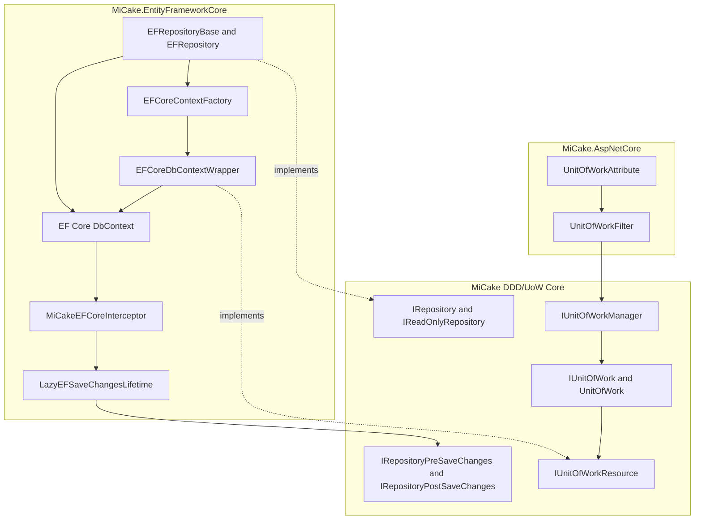
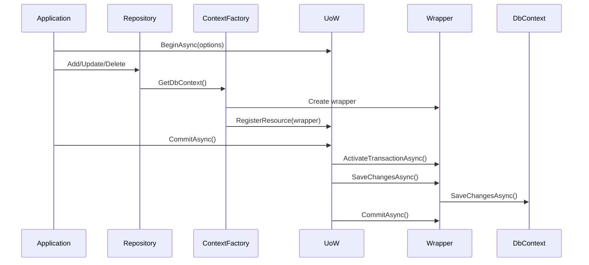
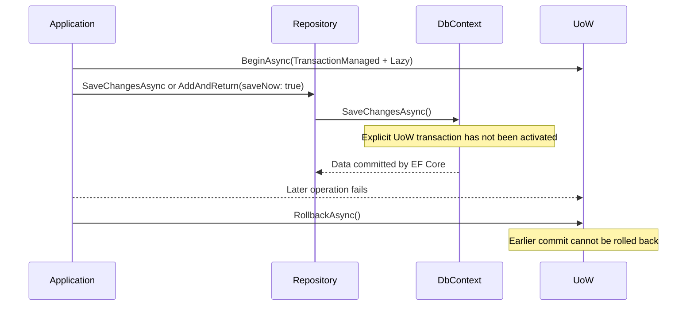
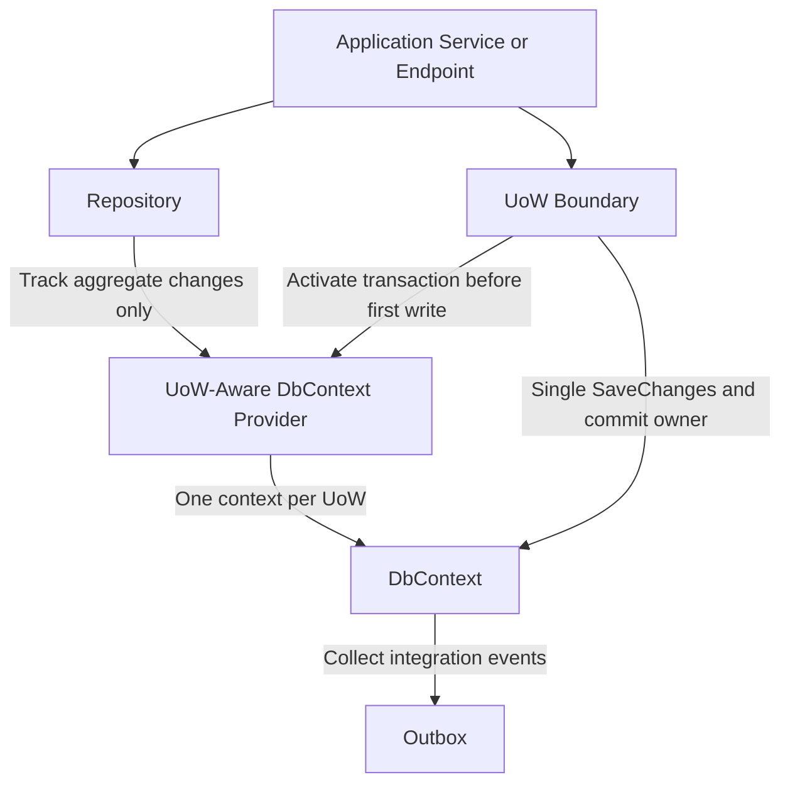

# UoW, Repository, and EF Core Architecture Assessment

> Project: MiCake
> Scope: `MiCake.DDD.Uow`, `MiCake.EntityFrameworkCore.Repository`, `MiCake.EntityFrameworkCore.Uow`, EF Core save interceptors, and ASP.NET Core automatic UoW integration
> Assessment date: 2026-08-06
> Branch: `dev`
> Method: Source-level architecture review plus focused execution of existing UoW and repository tests

---

## 1. Executive Summary

The current architecture has a sound structural foundation:

- The DDD/UoW abstractions do not depend on EF Core.
- EF Core participates through the persistence-neutral `IUnitOfWorkResource` abstraction.
- Repository interfaces target aggregate roots.
- Transaction activation supports lazy and immediate modes.
- Nested UoWs propagate resource ownership and rollback intent to the root UoW.
- Audit and domain-event behavior is extensible through repository lifecycle handlers.

However, the transaction contract is not currently reliable enough to guarantee atomic behavior in all supported API paths. The main architectural problem is that both Repository and Unit of Work can persist changes. This creates two competing commit paths with different transaction behavior.

The most important defects are:

1. `TransactionManaged + Lazy` does not protect an early `SaveChangesAsync`, `AddAndReturnAsync(saveNow: true)`, `ExecuteDeleteAsync`, or direct DbContext write because the explicit transaction is not activated until UoW commit.
2. `DeleteByIdAsync` performs an immediate physical delete, bypassing ChangeTracker, soft deletion, audit handlers, and the UoW save boundary.
3. `requiresNew` creates a new logical UoW but normally reuses the same scoped DbContext, and disposing the new root clears the ambient UoW instead of restoring the outer root.
4. `LazyEFSaveChangesLifetime` is a singleton that stores operation-specific scope state in an instance field, causing concurrency races and scope leaks.
5. Read-only UoWs are inferred from action names and can behave inconsistently depending on which repository method is called.

Overall assessment: **the layering and abstraction model are reasonable, but persistence ownership and transaction semantics require redesign before the framework can safely promise complete UoW atomicity.**

---

## 2. Current Architecture

### 2.1 Intended Write Flow

The intended UoW-oriented path appears to be:

### 2.2 Actual Alternative Write Flow

Repository methods can also persist independently:

This second path is the central architectural inconsistency.

---

## 3. Positive Design Elements

### 3.1 Correct Dependency Direction

The DDD UoW contracts are defined independently of EF Core. `MiCake.EntityFrameworkCore` depends on the core abstractions, not the reverse. This preserves persistence substitution and keeps EF-specific concerns outside the domain-facing contracts.

### 3.2 Persistence-Neutral Resource Model

`IUnitOfWorkResource` provides a general protocol for:

- preparation;
- transaction activation;
- saving;
- commit and rollback;
- savepoints;
- resource disposal.

This is a useful abstraction for supporting persistence providers other than EF Core.

### 3.3 Two-Phase Resource Registration

The Prepare/Activate split avoids asynchronous I/O during synchronous registration. Lazy mode can avoid opening a transaction for operations that never access a persistence resource.

### 3.4 Nested UoW Rollback Propagation

Nested UoWs delegate resource registration to the root and propagate rollback intent through `_shouldRollback`. This is a reasonable ambient UoW model when nested operations are intended to share one transaction.

### 3.5 Aggregate-Root Repository Constraint

The generic repository contracts require `IAggregateRoot<TKey>`, which aligns repository boundaries with DDD aggregate ownership rather than exposing repositories for arbitrary entities.

### 3.6 Extensible Save Lifecycle

The ordered pre/post handler pipeline supports audit updates, soft deletion, domain-event dispatch, and cleanup without hard-coding all behavior into the repository implementation.

---

## 4. Critical Defects

## 4.1 Competing Persistence Owners

**Severity:** Critical  
**Priority:** P0

### Evidence

Repository exposes direct persistence methods:

- `IRepository.SaveChangesAsync`
- `EFRepository.AddAndReturnAsync(..., saveNow: true)`
- direct `DbContext.SaveChangesAsync`
- `EFRepository.DeleteByIdAsync` through `ExecuteDeleteAsync`

Unit of Work independently saves all registered resources during `CommitAsync`.

Relevant files:

- `src/framework/MiCake/DDD/Domain/IRepository.cs`
- `src/framework/MiCake.EntityFrameworkCore/Repository/EFRepository.cs`
- `src/framework/MiCake/DDD/Uow/Internal/UnitOfWork.cs`
- `src/framework/MiCake.EntityFrameworkCore/Uow/EFCoreDbContextWrapper.cs`

### Defect

Repository and UoW both act as commit coordinators. A caller cannot infer transaction behavior from the repository interface alone because persistence depends on:

- whether a UoW exists;
- persistence strategy;
- initialization mode;
- whether the repository method saves immediately;
- whether the operation uses ChangeTracker or an immediate SQL operation.

The global automatic UoW path uses `UnitOfWorkOptions.Default`, which selects `OptimizeForSingleWrite + Lazy`. Under this strategy MiCake does not start an explicit transaction. An explicit `[UnitOfWork]` instead selects `TransactionManaged + Lazy`. Unless an external user-managed transaction already exists, an early SaveChanges under the default strategy is therefore outside any rollback boundary, while the explicit attribute path intends transaction management but activates it too late.

### Impact

- Writes can persist before the UoW commits.
- A later UoW rollback may not reverse earlier writes.
- Different repository methods behave differently under the same UoW.
- Domain-event and audit behavior depends on the selected write method.

### Required Architecture Decision

Select one persistence owner:

**Preferred model:** Repository changes aggregate state and ChangeTracker only; UoW is the only commit owner while a UoW is active.

Compatibility model: Keep repository `SaveChangesAsync` for standalone operations, but reject or redirect it when an active UoW exists.

### Recommended Direction

1. Define UoW commit as the only persistence boundary while `IUnitOfWorkManager.Current` is non-null.
2. Deprecate `saveNow` or make it invalid inside an active UoW.
3. Keep explicit immediate persistence only through a clearly named standalone API.
4. Document exact behavior for no-UoW operation.

---

## 4.2 Lazy Transaction Activation Occurs Too Late

**Severity:** Critical  
**Priority:** P0

### Evidence

`EFCoreContextFactory.GetDbContextWrapper()` registers and prepares the resource but does not activate its transaction.

`UnitOfWork.CommitAsync()` calls `ActivatePendingResourcesAsync()` immediately before commit operations.

`UnitOfWorkAttribute` creates `TransactionManaged + Lazy` options by default.

### Defect

A write executed before `CommitAsync()` can reach the database before the explicit transaction starts.

This affects:

- `repository.SaveChangesAsync()`;
- `AddAndReturnAsync(saveNow: true)`;
- direct `DbContext.SaveChangesAsync()`;
- `ExecuteDeleteAsync()`;
- `ExecuteUpdateAsync()`;
- raw SQL commands.

### Impact

A successful early write cannot be reversed by a later UoW rollback. This violates the expected meaning of `TransactionManaged`.

### Recommended Direction

Activate a lazy transaction before the first database write, not only before UoW commit.

Possible implementations:

1. Add an EF Core transaction interceptor that asks the active UoW to activate pending resources before SaveChanges or bulk SQL execution.
2. Make Repository write methods call `EnsureTransactionActivatedAsync()` before any database write.
3. Change explicit `[UnitOfWork]` operations to Immediate mode until reliable write-triggered activation exists.

The activation design must cover SaveChanges, bulk operations, and raw SQL. Covering only repository SaveChanges is insufficient because consumers can access DbContext directly.

---

## 4.3 `DeleteByIdAsync` Bypasses Repository Lifecycle Semantics

**Severity:** Critical  
**Priority:** P0

### Evidence

`EFRepository.DeleteByIdAsync` calls `ExecuteDeleteAsync` directly.

### Defect

`ExecuteDeleteAsync`:

- executes SQL immediately;
- bypasses ChangeTracker;
- does not wait for UoW `SaveChangesAsync`;
- does not invoke SaveChanges interceptors;
- does not invoke audit handlers;
- does not invoke soft-deletion handlers;
- does not invoke aggregate/domain lifecycle behavior.

### Impact

`DeleteAsync(entity)` and `DeleteByIdAsync(id)` have materially different semantics despite appearing to be equivalent repository operations.

In Lazy mode, the delete may execute outside an explicit transaction. In Immediate TransactionManaged mode it remains transaction-protected, but lifecycle handlers are still bypassed.

### Recommended Direction

Implement aggregate deletion through tracked state:

1. Load the aggregate by identifier.
2. Return or throw according to a documented not-found policy.
3. Call `DbSet.Remove(aggregate)`.
4. Let UoW commit trigger SaveChanges and lifecycle handlers.

If a direct physical delete API is required for administrative or bulk scenarios, expose it separately with an explicit name such as `ExecutePhysicalDeleteAsync` and document that it bypasses aggregate semantics.

---

## 4.4 `requiresNew` Does Not Provide an Independent EF Core Context

**Severity:** Critical  
**Priority:** P0

### Evidence

- `IUnitOfWorkManager` is scoped.
- EF Core DbContext is normally scoped.
- `EFCoreContextFactory` resolves DbContext from the same scoped service provider.
- `requiresNew` creates a new logical root UoW but does not create a new DI scope.

### Defect

Outer and `requiresNew` UoWs normally share the same DbContext and ChangeTracker.

Three failure modes result:

1. If the outer transaction has not started, the new root can save changes tracked by the outer operation.
2. If the outer transaction is active, the new root can attempt to open another transaction on the same DbContext and fail.
3. Creating the new root replaces `IUnitOfWorkManager.Current`; disposing it clears the ambient value instead of restoring the still-live outer root. Subsequent repository operations therefore lose the outer UoW boundary.

### Test Gap

Existing unit tests verify only that the new UoW has no parent and a different UoW identifier. They do not verify DbContext identity or database isolation.

The integration test named for resource-registration isolation commits the outer UoW before creating the new root, so it does not test overlapping `requiresNew` behavior.

No test verifies that `IUnitOfWorkManager.Current` returns to the outer root after the new root is disposed.

### Recommended Direction

Choose one explicit contract:

- **Restrict:** Declare EF Core `requiresNew` unsupported inside an active UoW and throw a clear exception.
- **Implement fully:** Create a child `IServiceScope` for the new root, resolve a separate DbContext, repository, and context factory from that scope, and restore the previous ambient UoW when the new root is disposed.

A logical UoW identifier alone is insufficient to implement `requiresNew` semantics.

---

## 4.5 Singleton Save-Lifecycle State Is Not Concurrency Safe

**Severity:** Critical  
**Priority:** P0

### Evidence

`IEFSaveChangesLifetime` is registered as a singleton. `LazyEFSaveChangesLifetime` stores the current pre-save scope in an instance field named `_currentScope`.

### Defect

Concurrent SaveChanges operations can overwrite, reuse, clear, or dispose each other's scope. The scope also remains undisposed when a pre-save handler fails, the database save fails, an optimistic concurrency exception occurs, or SaveChanges is canceled because the post-save callback never runs. `SaveChangesFailed` clears interceptor entry state but does not notify `LazyEFSaveChangesLifetime`, and the interceptor does not implement a SaveChanges-canceled callback.

### Impact

- `ObjectDisposedException` under concurrent writes;
- wrong scoped service provider supplied to handlers;
- cross-request state leakage;
- undisposed scoped resources.

### Recommended Direction

Remove cross-stage singleton state. The smallest safe design is:

- create an independent `AsyncServiceScope` for each pre-save invocation;
- create another independent `AsyncServiceScope` for each post-save invocation;
- dispose each scope in its own call.

If same-scope pre/post behavior is a required contract, associate scope state with a specific DbContext save operation and clean it on success, failure, and cancellation. Do not associate it with the singleton instance globally.

---

## 5. Important Design Deficiencies

## 5.1 Read-Only UoW Is Inferred from Action Names

**Severity:** Warning  
**Priority:** P1

### Evidence

`UnitOfWorkFilter` treats action names starting with `Find`, `Get`, `Query`, or `Search` as read-only by default.

### Defect

Method naming is not a reliable declaration of persistence intent.

Furthermore, read-only behavior is inconsistent:

- `AddAsync` changes only ChangeTracker and is not persisted when the filter calls `MarkAsCompletedAsync`.
- `AddAndReturnAsync(saveNow: true)` persists immediately even in a read-only UoW.
- direct SQL operations can also persist immediately.

### Recommended Direction

1. Add explicit `IsReadOnly` support to `UnitOfWorkAttribute`, or introduce `ReadOnlyUnitOfWorkAttribute`.
2. Treat action-name inference as an optional compatibility feature.
3. Detect pending changes or writes in a read-only UoW and throw or log a high-severity warning.
4. Ensure read-only mode prevents all framework-mediated write paths.

---

## 5.2 Repository-Level Context Cache Duplicates DI and UoW Responsibilities

**Severity:** Warning  
**Priority:** P1

### Evidence

`EFRepositoryBase` maintains a dictionary keyed by UoW identifier, despite Repository being transient and DbContext/ContextFactory being scoped.

### Defect

The cache adds:

- a reader/writer lock;
- dictionary state;
- UoW event subscriptions;
- cleanup handling;
- a separate no-UoW path;
- duplicate wrapper/context resolution concerns.

It does not solve `requiresNew`, because the underlying scoped provider still returns the same DbContext.

### Recommended Direction

Make `EFCoreContextFactory` the single owner of UoW-to-DbContext identity. Repository should request the current context from the factory and should not maintain its own transaction-aware cache.

If the cache remains, the no-UoW path must cache consistently, and synchronous properties and asynchronous helpers must use the same cache path.

---

## 5.3 No-UoW Context Identity Depends on DI Lifetime

**Severity:** Warning  
**Priority:** P1

### Evidence

When no UoW is active and bypass is enabled, `EFRepositoryBase` creates a new `CacheContext` wrapper on every access. `EFCoreContextFactory` resolves DbContext from DI each time.

### Defect

Scoped DbContext registration masks the issue by returning the same instance. Transient registration or a custom factory can return different contexts between Add and SaveChanges.

### Impact

Tracked changes may be added to one DbContext and SaveChanges may be invoked on another.

### Recommended Direction

Either:

- enforce scoped DbContext lifetime as a framework requirement; or
- cache one no-UoW context identity per repository/request and use it consistently across all access methods.

The framework should validate unsupported lifetimes during startup where possible.

---

## 5.4 Multiple Resource Commit Is Best-Effort, Not Atomic

**Severity:** Warning  
**Priority:** P2

### Evidence

`UnitOfWork.ExecuteCommitOperationsAsync()` saves and commits resources sequentially.

### Defect

If resource 1 commits and resource 2 fails, resource 1 cannot be rolled back. Without a distributed transaction coordinator, multi-resource atomicity is not available.

### Current Scope

The standard EF Core setup maintains one primary DbContext type, so this is primarily an extension-contract concern rather than the most common runtime path.

### Recommended Direction

- Document multi-resource commit as best-effort.
- Emit a warning when multiple independently committed resources participate.
- Use Outbox/Saga patterns for cross-resource consistency.
- Do not advertise distributed ACID semantics.

---

## 5.5 Detached `UpdateAsync` Marks the Full Aggregate Modified

**Severity:** Warning  
**Priority:** P2

### Evidence

`EFRepository.UpdateAsync` calls `DbSet.Update(aggregateRoot)`.

### Defect

For a detached aggregate, EF marks all scalar properties as modified. This can:

- overwrite concurrent changes;
- produce broad UPDATE statements;
- bypass intended partial-update semantics;
- make concurrency-token behavior harder to reason about.

### Recommended Direction

Document that `UpdateAsync` is a detached full-aggregate replacement operation. Prefer loading and modifying tracked aggregates. For partial updates, require explicit changed-field semantics.

---

## 5.6 Interceptor Entry State May Be Unsafe Under Shared Interceptor Instances

**Severity:** Warning  
**Priority:** P2

### Evidence

`MiCakeEFCoreInterceptor` stores changed entries in an instance field `_changedEntries` between SavingChanges and SavedChanges callbacks.

### Scope

This is normally safe when each scoped DbContext receives a distinct interceptor and the DbContext is not used concurrently. It becomes unsafe when an interceptor instance is shared through pooled/shared options or explicit singleton registration.

### Recommended Direction

Associate pending entries with DbContext identity or save-operation identity and clean them on:

- success;
- save failure;
- cancellation;
- pre-save handler failure.

Do not assume interceptor instance lifetime always equals DbContext lifetime.

---

## 5.7 Post-Save Handlers Lose the Pre-Save Entity State

**Severity:** Warning  
**Priority:** P1

### Evidence

`MiCakeEFCoreInterceptor` stores references to changed `EntityEntry` instances before SaveChanges. `LazyEFSaveChangesLifetime.ProcessPostSaveHandlersAsync()` converts each entry's current EF state only after SaveChanges has completed.

### Defect

EF Core normally changes Added and Modified entries to Unchanged and Deleted entries to Detached after a successful save. Post-save handlers therefore do not reliably receive the repository state that caused the save.

The built-in domain-event cleanup handler does not depend on the state, so the current built-in behavior is not broken. The public `IRepositoryPostSaveChanges` extension contract is nevertheless misleading for custom handlers that distinguish Added, Modified, and Deleted operations.

### Recommended Direction

Capture the entity and its repository state during SavingChanges and associate that snapshot with the DbContext/save-operation identity. Pass the captured state to post-save handlers and clear it on success, failure, and cancellation.

---

## 5.8 Rollback Failures Are Logged but Suppressed

**Severity:** Warning  
**Priority:** P1

### Evidence

`EFCoreDbContextWrapper.RollbackAsync()` catches exceptions from `IDbContextTransaction.RollbackAsync()`, logs them, and does not rethrow.

### Defect

`UnitOfWork.RollbackInternalAsync()` consequently treats a failed provider rollback as successful, resets its transaction state, and may raise rollback-completed events even though the database outcome is uncertain. Disposing the transaction afterward may trigger provider cleanup, but it does not replace explicit failure propagation.

### Recommended Direction

Dispose the transaction in `finally`, but propagate the rollback exception to the UoW coordinator so callers can observe an uncertain transaction outcome. Preserve multiple rollback failures through the existing aggregate-exception path.

---

## 6. Minor Deficiencies

## 6.1 Resource Identity Uses `GetHashCode()`

`EFCoreDbContextWrapper.ResourceIdentifier` combines context type and `DbContext.GetHashCode()`.

Hash codes are not guaranteed unique. A collision can cause two resources to be incorrectly treated as the same resource.

Use an explicit wrapper identifier, a `ConditionalWeakTable`, reference-equality keying, or `RuntimeHelpers.GetHashCode` with a reference comparison strategy.

## 6.2 Unused `IDbContextWrapper` Abstraction

`MiCake.DDD.Uow.IDbContextWrapper` has no usages. `IUnitOfWorkResource` appears to have replaced it.

Remove it or document and integrate its intended responsibility. Keeping overlapping unused abstractions increases maintenance cost.

## 6.3 Reflection-Based Immediate Initialization

`ImmediateTransactionInitializer` uses `MakeGenericType`, `GetMethod`, and reflection invocation to resolve generic context factories.

This weakens compile-time safety and makes errors appear at runtime. Consider registering a non-generic resource-initializer adapter per DbContext type.

## 6.4 Paging Without Deterministic Ordering

The basic `PagingQueryAsync` overload applies `Skip/Take` without `OrderBy`. Results are not deterministic, and some providers can reject or warn about this pattern.

Apply a deterministic default order before pagination.

## 6.5 Synchronous Resource Disposal Only

UoW and resource interfaces expose `IDisposable` but not `IAsyncDisposable`, despite EF Core transactions and scopes supporting asynchronous disposal.

Add asynchronous disposal support in a future breaking-change window.

## 6.6 Static Interceptor Factory Is Process-Global

`MiCakeInterceptorFactoryHelper` stores one interceptor factory in a static field. The implementation documents this limitation and resets the field during application shutdown, but parallel application hosts or integration-test hosts in the same process can overwrite or clear each other's factory.

Prefer DI-based interceptor configuration. Retain the static helper only as a compatibility path, and avoid treating it as safe for concurrent multi-host scenarios.

---

## 7. Domain Event and Audit Semantics

The pre-save domain-event model is not inherently incorrect.

Two common event categories must be distinguished:

| Event category | Recommended timing |
|---|---|
| In-process domain event whose handlers participate in the same transaction | Before SaveChanges or before transaction commit |
| Integration event or external notification | After durable commit, preferably through an Outbox |

MiCake currently dispatches domain events in a pre-save handler and clears them in a post-save handler. This can be reasonable if the following contract is made explicit:

- handlers are in-process domain handlers;
- handler database writes participate in the same UoW;
- recursive SaveChanges behavior is defined or prohibited;
- failures prevent persistence according to configured strategy;
- external publishing uses an Outbox rather than direct pre-save delivery.

The actual architectural risk is not pre-save dispatch itself. It is that early SaveChanges may occur before transaction activation and that handler scopes are currently resolved through unsafe singleton state.

---

## 8. Architecture Rating

| Dimension | Rating | Assessment |
|---|---:|---|
| Layering and dependency direction | 8/10 | Clean separation between DDD contracts and EF Core implementation |
| Persistence-neutral UoW abstraction | 8/10 | Strong resource abstraction with useful extension points |
| Aggregate repository model | 7/10 | Correct aggregate constraints, but persistence methods are too broad |
| Transaction correctness | 4/10 | Lazy activation and direct persistence paths violate expected UoW atomicity |
| Lifecycle consistency | 3/10 | Save hooks are extensible, but scope cleanup and post-save state ownership are unsafe |
| Nested UoW | 7/10 | Shared-transaction nesting is reasonable |
| `requiresNew` semantics | 2/10 | No independent context or scope, and the outer ambient UoW is not restored |
| Test confidence | 5/10 | Good unit coverage, but critical real-transaction paths are skipped |
| Overall | **6/10** | Sound foundation requiring transaction-contract redesign |

---

## 9. Recommended Target Architecture

### Target Rules

1. One DbContext identity per logical UoW.
2. A separate DbContext and DI scope for `requiresNew`, with deterministic restoration of the outer ambient UoW.
3. UoW owns SaveChanges and transaction commit while active.
4. Repository methods modify aggregate state but do not independently commit.
5. Bulk SQL APIs are explicit and documented as bypassing aggregate lifecycle behavior.
6. Lazy transaction activation occurs before the first database write.
7. Read-only behavior is explicit and enforced.
8. Domain events remain transaction-local; integration events use Outbox.
9. Interceptor and handler state is keyed to DbContext/save operation, never singleton-global.

---

## 10. Remediation Roadmap

### Phase 1: Correctness and Safety

| Priority | Work item | Expected outcome |
|---|---|---|
| P0 | Remove singleton `_currentScope` state | Eliminate cross-request scope race and leak |
| P0 | Define and enforce a single persistence owner | Restore predictable UoW semantics |
| P0 | Activate transaction before first write | Make TransactionManaged rollback reliable |
| P0 | Replace `DeleteByIdAsync` direct delete | Restore soft delete, audit, and UoW consistency |
| P0 | Restrict or correctly implement `requiresNew` | Prevent false transaction isolation and restore the outer ambient UoW |

### Phase 2: Contract Consistency

| Priority | Work item | Expected outcome |
|---|---|---|
| P1 | Make read-only intent explicit and enforce it | Remove naming-based write inconsistencies |
| P1 | Consolidate context identity in ContextFactory | Remove repository-side cache complexity |
| P1 | Enforce supported DbContext lifetime | Prevent transient context identity defects |
| P1 | Define domain versus integration event timing | Make event consistency guarantees explicit |
| P1 | Preserve pre-save state for post-save handlers | Make lifecycle extension semantics reliable |
| P1 | Propagate rollback failures | Expose uncertain database outcomes to callers |

### Phase 3: Maintainability and Advanced Scenarios

| Priority | Work item | Expected outcome |
|---|---|---|
| P2 | Document multi-resource best-effort behavior | Avoid false distributed transaction guarantees |
| P2 | Clarify detached update semantics | Reduce lost-update risk |
| P2 | Remove unused `IDbContextWrapper` | Simplify public architecture |
| P2 | Replace reflection-based immediate initialization | Improve type safety |
| P2 | Add async disposal | Align lifecycle with EF Core async resources |
| P2 | Retire the static interceptor factory path | Avoid cross-host factory interference |

---

## 11. Required Verification Plan

The remediation should not be considered complete until the following tests run against a real relational provider, preferably PostgreSQL or SQL Server in a disposable container.

### 11.1 Transaction Tests

1. `TransactionManaged + Lazy`: early repository SaveChanges followed by rollback leaves no data.
2. `TransactionManaged + Lazy`: `AddAndReturnAsync(saveNow: true)` followed by rollback leaves no data.
3. `TransactionManaged + Lazy`: direct `ExecuteDeleteAsync` behavior matches the documented contract.
4. `Immediate`: direct writes are rolled back correctly.
5. Savepoint is created before any write intended to be protected by it.
6. Commit failure rolls back every resource that has not already committed.

### 11.2 `requiresNew` Tests

1. Outer and new-root UoWs resolve different DbContext instances.
2. Inner new-root commit does not persist outer pending changes.
3. Inner new-root rollback does not alter outer ChangeTracker state.
4. Outer and new-root transactions can overlap without transaction-conflict exceptions.
5. Disposing the new-root UoW restores `IUnitOfWorkManager.Current` to the outer UoW.
6. Repository operations after the new root is disposed continue to register with the outer UoW.

### 11.3 Repository Tests

1. `DeleteAsync` and `DeleteByIdAsync` both trigger soft deletion when configured.
2. Audit handlers execute consistently for all normal repository write methods.
3. Repository methods inside an active UoW do not independently commit.
4. No-UoW operation has deterministic context identity.

### 11.4 Lifecycle and Concurrency Tests

1. Concurrent SaveChanges operations never share handler scopes.
2. Pre-save handler failure disposes its scope.
3. Database save failure disposes operation state.
4. Cancellation disposes operation state.
5. Pooled DbContext/interceptor use does not mix changed-entry collections.
6. Post-save handlers receive the pre-save Added, Modified, or Deleted state.
7. Provider rollback failure is propagated to the UoW caller.

### 11.5 Current Test Status

A focused test run completed with:

- 18 tests passed;
- 4 transaction/savepoint tests not run because they are marked with `Fact(Skip = ...)`;
- no executed test failures.

The skipped tests cover the most important real transaction behavior. Existing green tests therefore do not validate the critical rollback, savepoint, and transaction-activation concerns described in this document.

---

## 12. Final Assessment

The current design should be treated as a **good architectural foundation with an incomplete transaction contract**.

It is reasonable to preserve:

- the project layering;
- the persistence-neutral UoW contracts;
- the resource registration model;
- aggregate-root repository boundaries;
- nested shared-transaction UoWs;
- repository lifecycle extension points.

It is not currently reasonable to guarantee:

- rollback of every write performed inside a Lazy TransactionManaged UoW;
- isolation of `requiresNew` UoWs;
- restoration of the outer ambient UoW after a `requiresNew` UoW;
- lifecycle consistency for direct bulk operations;
- reliable pre-save state delivery to post-save handlers;
- atomic commit across multiple independently committed resources;
- strict read-only enforcement based on action-name inference.

The next architectural design should first define persistence ownership, write-triggered transaction activation, `requiresNew` scope and ambient identity, failure-aware lifecycle state, and bulk-operation semantics. Local bug fixes should then be implemented against that contract rather than independently patching each symptom.
